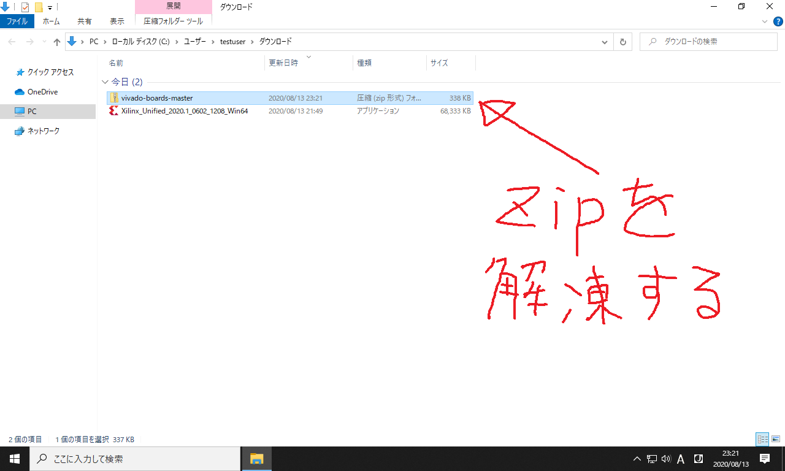
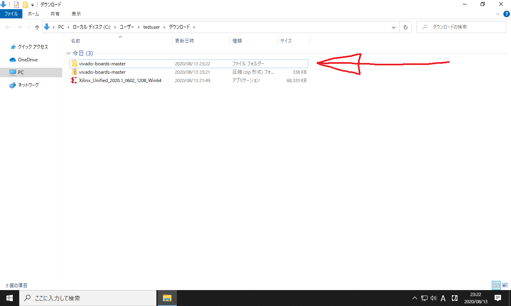
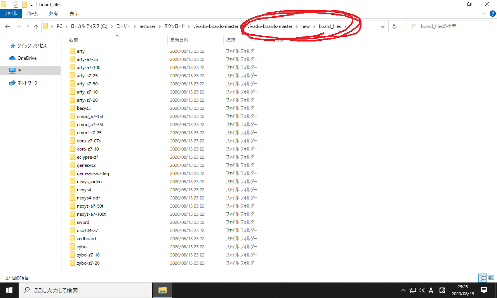
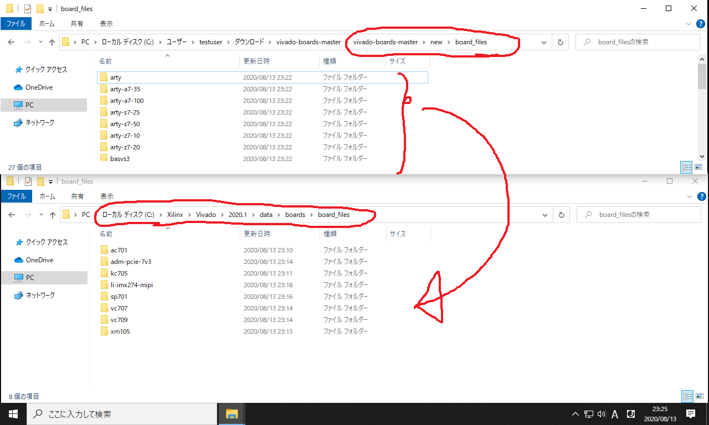
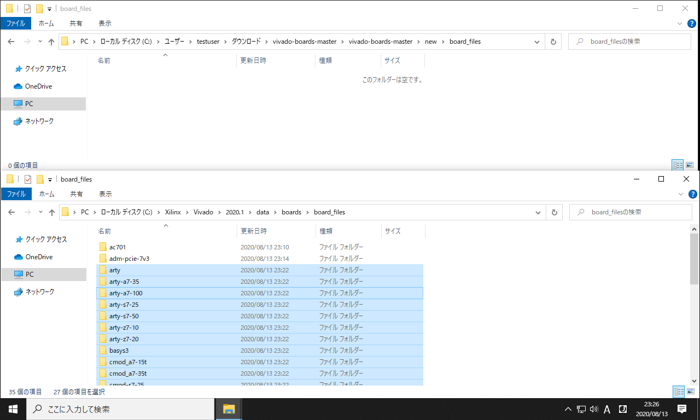

### 作業の目次

1. [Vivadoのダウンロード](../download/index.md)
2. [Vivadoのインストール](../install/index.md)
3. [Vivadoへのデバイス情報の追加](../board/index.md) <------- (here)
4. [プロジェクトの作成](../project/index.md)
5. [回路図の表示](../schematic/index.md)
6. [電圧シミュレーション](../wave/index.md)
7. [ソースコードのコンパイル](../compile/index.md)

[目次のページに戻る](../vivado/index.md)

# Vivadoへのデバイス情報の追加

以下のリンクをクリックして `vivado-board-master.zip` というファイルをダウンロードして下さい。

<https://github.com/Digilent/vivado-boards/archive/master.zip>

そして得られた zip ファイルを解凍して下さい。
右クリックで「展開」を押せば解凍されます。

01  

解凍の結果 `vivado-board-master` というフォルダが生成されます。
これを開きます。

02  

`new` フォルダ内の `board_files` フォルダを開くと、以下のように様々なFPGA評価ボードの基板情報が入っています。

03  

次に `C:\Xilinx\Vivado\2020.1\data\boards\board_files` のフォルダを開きます。
そしてさっきの基板情報の全フォルダを移動します。

04  

移し終えると、以下のようになります。
移動先を間違えやすいので、画像内のファイルパスをよく確認して下さい。

05  

以上で基板情報が Vivado に追加されました。
引き続き [プロジェクトの作成](../project/index.md) のページに進んで下さい。

# デバイスファイルとは

このページで行った作業の内容が意味不明だったと思うので、補足します。
まず用語の整理です。
Arty-S7-50 を例に説明すると

|                |これは何              |作った会社|説明                     |
|:---------------|:---------------------|:---------|:------------------------|
|Arty-S7-50      |FPGA評価ボード (物理) |Digilent  |13000円ぐらいの回路基板  |
|デバイスファイル|普通のファイル        |Digilent  |Arty-S7-50の仕様書       |
|Spartan-7       |FPGAコア (物理)       |Xilinx    |Arty-S7-50の中心的パーツ |
|Vivado          |統合開発環境 (ソフト) |Xilinx    |Spartan-7に回路を書き込む|

要するに Arty-S7-50 に搭載されている Spartan-7 の中に、 Vivado を使って回路を書き込みたいのです。
重要なポイントは、 Arty-S7-50 と Vivado は別会社の製品ということです。
そのため Arty-S7-50 に固有の設定を Vivado に追加する必要があります。
今回はこの追加作業を行いました。
