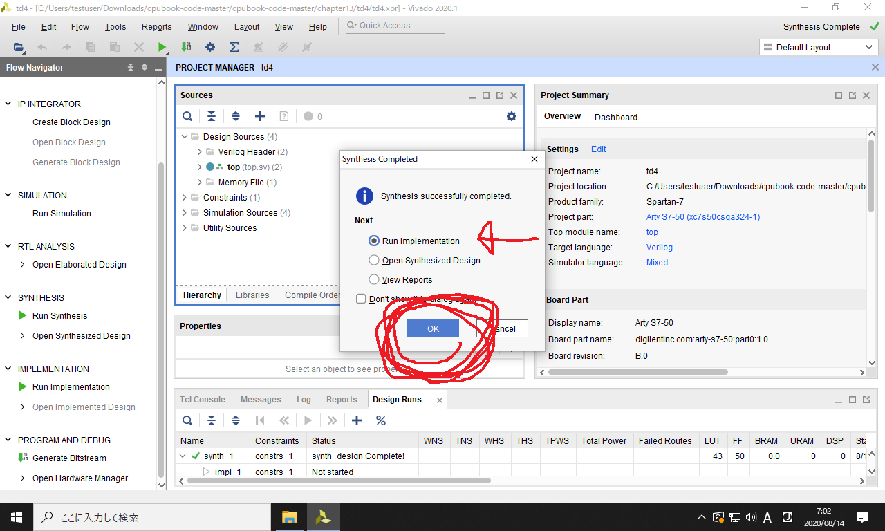

### 作業の目次

1. [Vivadoのダウンロード](../download/index.md)
2. [Vivadoのインストール](../install/index.md)
3. [Vivadoへのデバイス情報の追加](../board/index.md)
4. [プロジェクトの作成](../project/index.md)
5. [回路図の表示](../schematic/index.md)
6. [電圧シミュレーション](../wave/index.md)
7. [ソースコードのコンパイル](../compile/index.md) <------- (here)

[目次のページに戻る](../howto/index.md)

# ソースコードのビルド

以下では、Vivadoに登録したソースコードをコンパイルする手順を説明します。
実行には時間を要します(早いコンピュータで1分、遅いコンピュータで10分程度)。

基本的な操作の流れは以下の通りです。

01  


つまり以下の4つの操作を行えば、FPGA評価ボード上で回路が動きます。

1. `Run Synthesis` (論理合成)
2. `Run Implementation` (配置配線)
3. `Generate Bitstream` (ビットストリームのファイルを生成)

これらの意味については、本書の132ページで説明しています。
以下では作業内容を具体的に見ていきます。

### 1. 論理合成

左パネルの`SYNTHESIS`内の`Run Synthesis`をクリックすると、以下のダイアログが表示されるので、`OK`を押します。
これで論理合成の処理が走ります。
しばらく時間がかかります。

02  


しばらく待つと論理合成が終了し、以下のダイアログが表示されます。
まだ`OK`ボタンを押さなくても大丈夫です。

03  


### 2. 配置配線

以下のように`Run Implementation`が選択されていることを確認し、`OK`を押します。

04  


以下のダイアログが表示されるので、`OK`を押します。
これで配置配線の最適化が走ります。
しばらく時間がかかります。

05  


しばらく待つと配置配線が終了し、以下のダイアログが表示されます。
まだ`OK`ボタンを押さなくても大丈夫です。

06  


### 3. ビットストリームのファイルの生成

以下のように`Generate Bitstream`を選択し、`OK`を押します。
誤って未選択のまま`OK`ボタンを押した場合は、左側のパネルの下方の`Generate Bitstream`をクリックして下さい。

07  


以下のダイアログが表示されるので、`OK`を押します。
これでビットストリーム・ファイルの生成処理が走ります。
しばらく時間がかかります。

08  


しばらく待つとビットストリームのファイルが生成され、以下のダイアログが表示されます。
まだ`OK`ボタンを押さなくても大丈夫です。

09  


ちなみにビットストリームのファイルは、プロジェクトフォルダの以下のパスに生成されます。

```
chapter13\td4\td4.runs\impl_1\top.bit
```

# FPGA評価ボードへの書き込み

コンパイルで得られたビットストリームのファイルを、FPGA評価ボードに書き込む方法を説明します。
なおFPGA評価ボードを持っていない方は、ここで作業完了。
お疲れさまでした。

以下ではFPGA評価ボードとして Arty-S7-50 を例に説明します。
Arty-S7-25やArtyについても、作業内容は全く変わりません。

まず以下のように、FPGA評価ボードとパソコンを、マイクロUSBケーブル (スマホのAndroidを充電するケーブル) で繋ぎます。

arty-s7-1  


ダイアログの`Open Hardware Manager`を選択し、`OK`を押します。
ダイアログが消えた場合は、左側のパネルから`Open Hardware Manager`を選択して下さい。

10  


以下の`Open target`をクリックして下さい。

11  


以下の`Auto Connect`を選択します。

12  


うまくいけば、以下のようにFPGA評価ボード (Arty-S7-50) の検出に成功します。
これを確認した後、`Program Device`をクリックします。

13  


書き込むビットストリームのファイルを選択します。
以下の`...`のところをクリックして下さい。

14  


以下の `chapter13\td4\td4.runs\impl_1` のフォルダを開いて下さい。

15  


以下の `top.bit` を選択してください。
これがさっきのコンパイルで得られた、ビットストリームのファイルです。

16  


以下の `Program` のボタンを押して、FPGA評価ボードへの書き込みを完了して下さい。

17  


これでArty-S7-50上で回路が動き始めます。
本書の166ページに記載したキッチンタイマーのプログラムが走るはずです。

### FPGA評価ボードの動作

動作を理解するために、まず Arty-S7-50 の各部について説明します。

* 左下には緑のLEDが4個並んでいる。これがTD4の外部出力(ディスプレイ)に対応千ｕ
* 下部にはスライドスイッチが4個並んでいる。これがTD4の外部入力(キーボード)に対応する
* 右上のリセットボタンを押すと、キッチンタイマーがリセットされる

スイッチを「上上上下」に設定し、リセットボタンを押してみます。
すると以下のように、LEDが「光光光消」のように点灯します。

arty-s7-2  


要するにスイッチで入力した値が、LEDで表示されているのです。

そして10秒待つと、以下のようにLEDが4つとも点灯します。

arty-s7-3  


さらに10秒待つと、全てのLEDが一斉にチカチカと点灯を始めます。

arty-s7-4  


これで10秒を測ることができました。
スイッチを変更して右上のリセットボタンを押せば、10秒から160秒までの好きな時間を測ることが可能です。

キッチンタイマーに飽きたら、左上のボタンを押して回路を消去して下さい。
これでFPGA評価ボードが購入時の状態に戻ります。

以上で全ての作業が終わりです。
一通りFPGAの動かし方がつかめたと思います。
さらに先の話題としては、以下の2つがあります。

* FPGA評価ボードの電源を落としても、回路が消えないようにする (回路をフラッシュROMに書き込む)
* FPGA評価ボードとパソコンの間で、情報を送受信する(UARTを使う)

Arty-S7-50 であれば、これらを簡単に実現できます。
(そのうち説明用のページを追加します)

それでは本書の方に戻って下さい。
お疲れさまでした！
