### 作業の目次

1. [Vivadoのダウンロード](../download/index.md) <------- (here)
2. [Vivadoのインストール](../install/index.md)
3. [Vivadoへのデバイス情報の追加](../board/index.md)
4. [プロジェクトの作成](../project/index.md)
5. [回路図の表示](../schematic/index.md)
6. [電圧シミュレーション](../wave/index.md)
7. [ソースコードのコンパイル](../compile/index.md)

[目次のページに戻る](../howto/index.md)

# Vivadoのウェブインストーラーのダウンロード

以下ではXilinx社のFPGA統合開発環境Vivadoのインストール手順を説明します。
対象OSはWindowsです。

Vivadoはサイズの大きなソフトなので

1. まずウェブインストーラーをダウンロードする
2. それを使ってVivadoの本体をウェブからインストールする

という手順を踏みます。
このページではウェブインストーラーのダウンロードを行います。

### Xilinxアカウントの登録

ダウンロードにはXilinxへのアカウント登録が必要です。
以下のURLを開いて下さい。

<https://japan.xilinx.com/registration/create-account.html>

個人情報について聞かれるので入力します。
重要なのはメールアドレスで、これがアカウント名になります。

01  
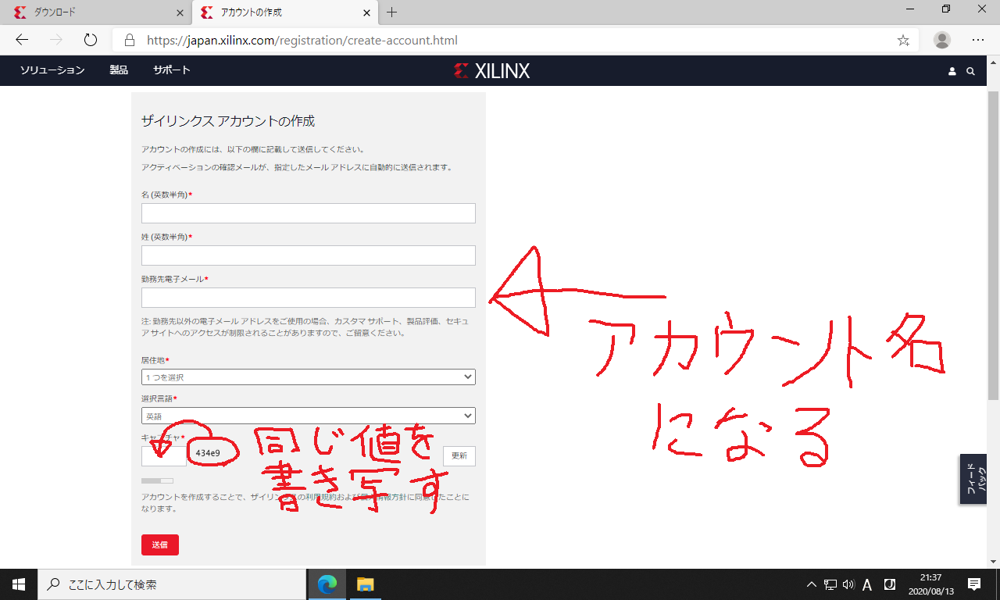

送信を押します。

02  
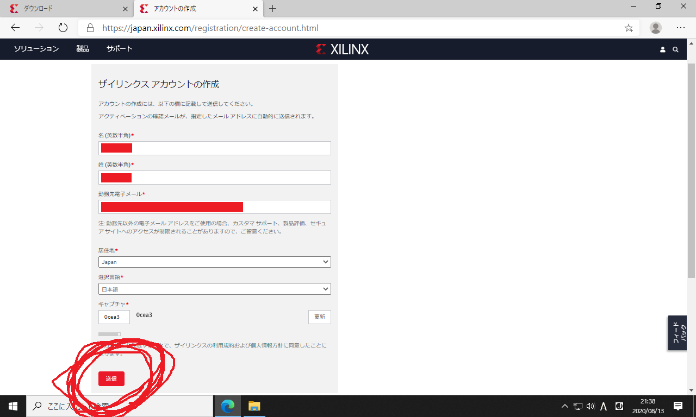

以下の画面に遷移すれば仮登録完了です。

03  
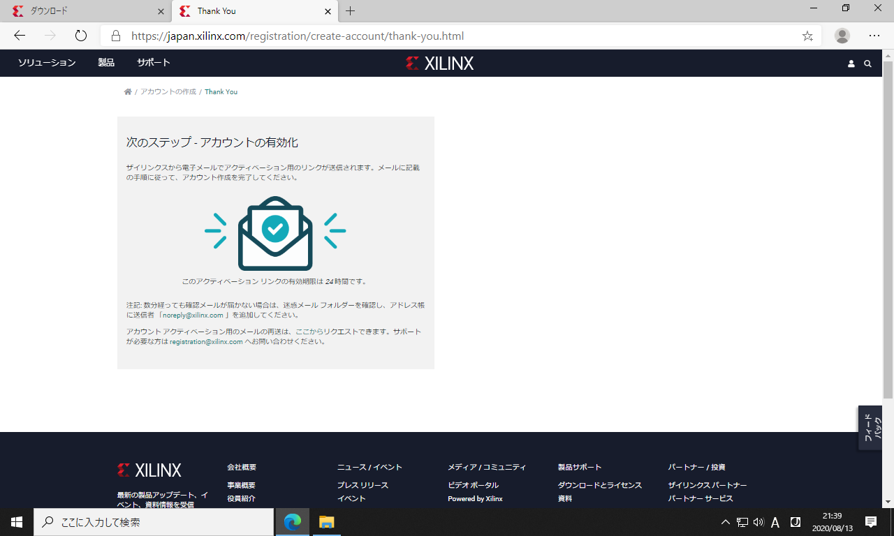

登録したメールアドレスに確認メールが送信されるので、メーラーを開いて「アカウントを有効にする」の部分をクリックします。

4  

以下のページが開きます。
ここでXilinxアカウント用のパスワードを好みの文字列に設定します。
このパスワードは後で使用します。

5  
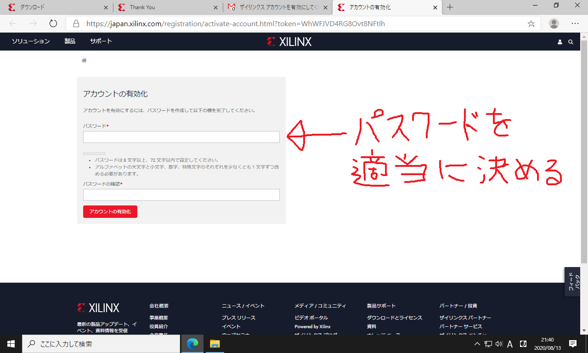

以下のように「アカウントを有効化」のボタンを押します。
これでアカウントの本登録が完了します。

6  
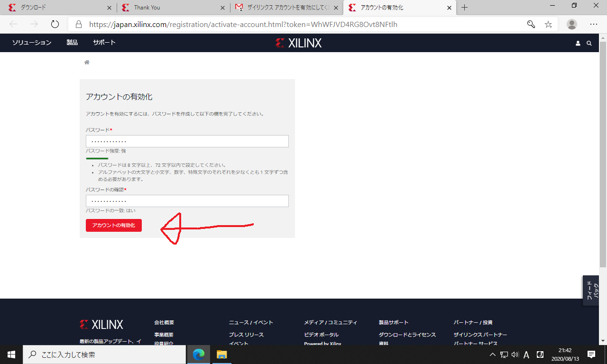

以下の画面が表示されれば、アカウント登録成功です。
サインインのボタンをクリックして下さい。

7  
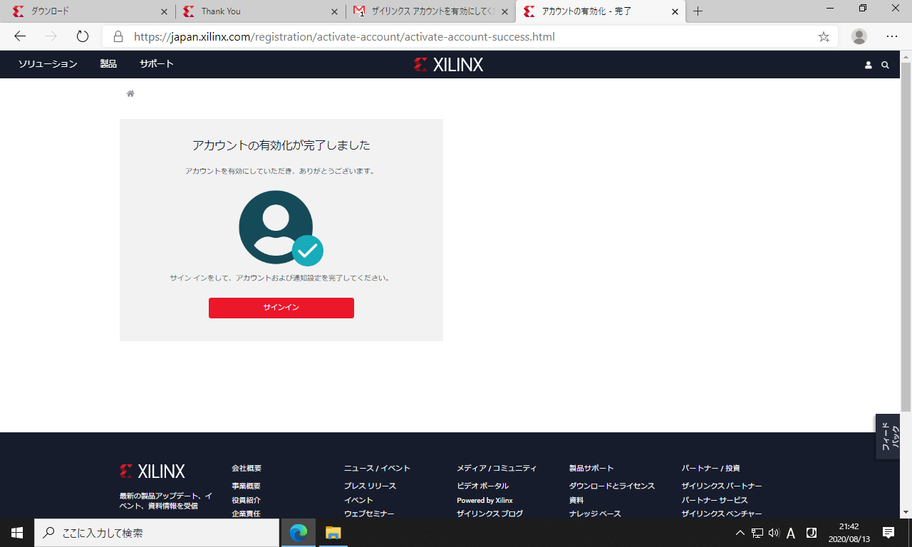

さっき登録したメールアドレスとパスワードを入力します。

8  
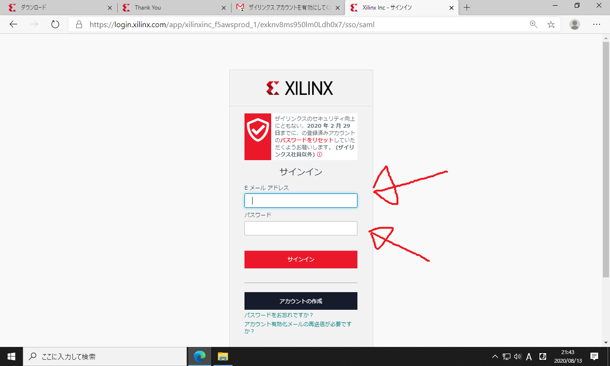

以下のサインインのボタンをクリックします。

9  
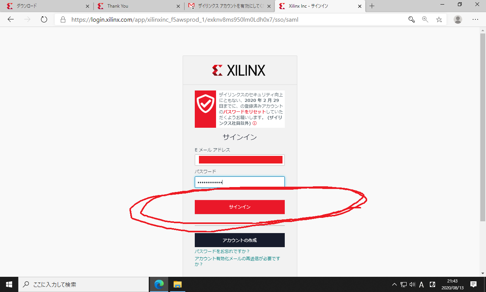

以下の画面が表示されれば、サインイン完了です。

10  
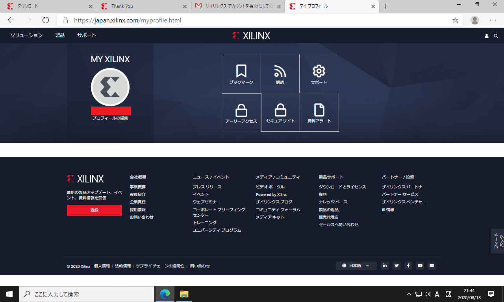

これでXilinx社の統合開発環境 (Vivado) がダウンロードできるようになりました。

### 統合開発環境(Vivado)のダウンロード

次のURLを開いて下さい。

<https://japan.xilinx.com/support/download.html>

ページをスクロールして、以下の「ザイリンクス統合インストーラー Windows用自己解凍型ウェブインストーラー」をクリックして下さい。

11  
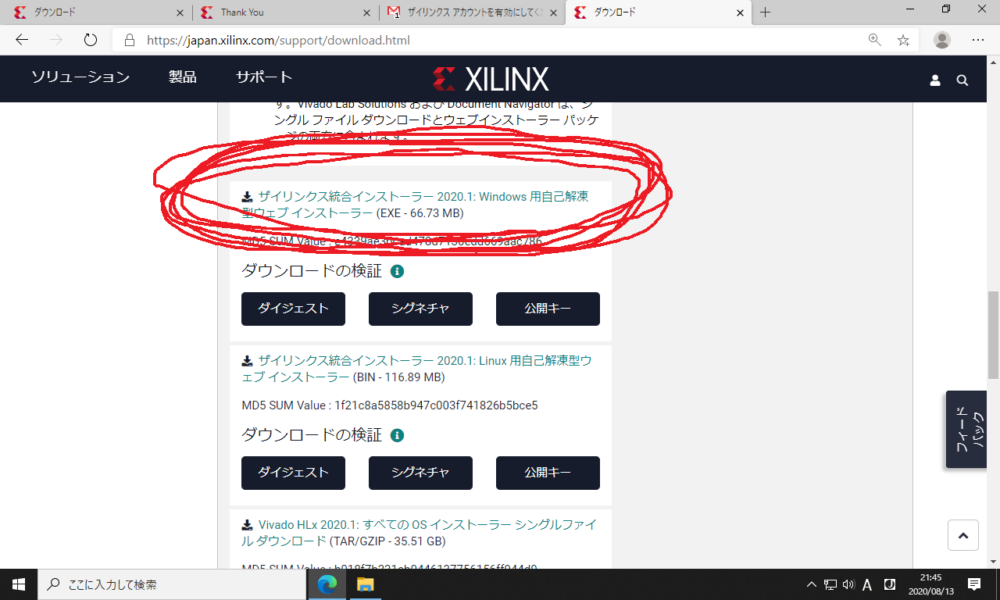

個人情報について聞かれるので入力します。
赤印の箇所だけ入力すればOKです。
名前とメールアドレスは、さっきアカウントを作ったときに登録したものを使用します。

12  
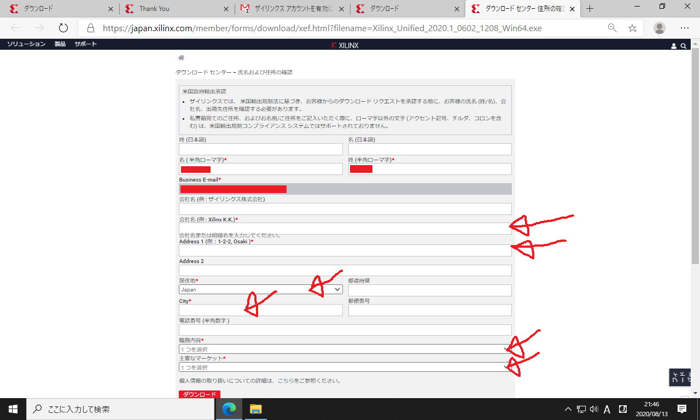

入力を終えたら下部の「ダウンロード」をクリックします。
これでダウンロードが始まります。

13  
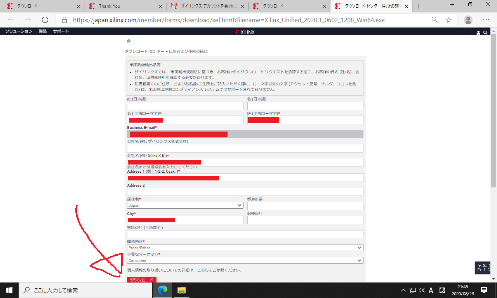

以下のようなウェブインストーラーがダウンロードされます。

14  
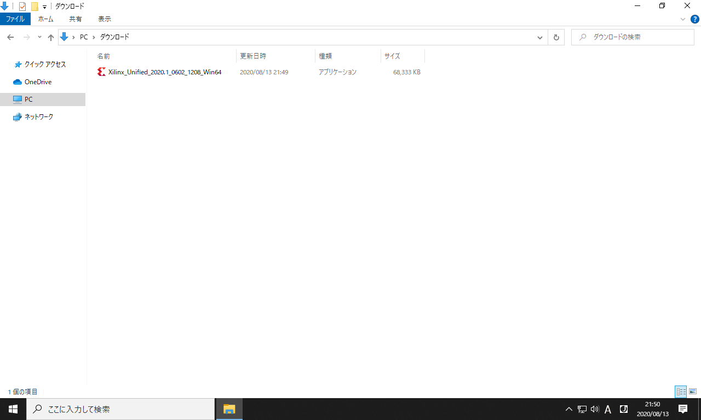

引き続き
[Vivadoのインストール](../install/index.md)
に進んで下さい。
