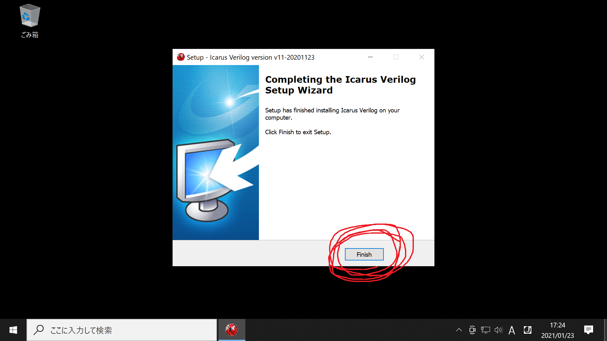
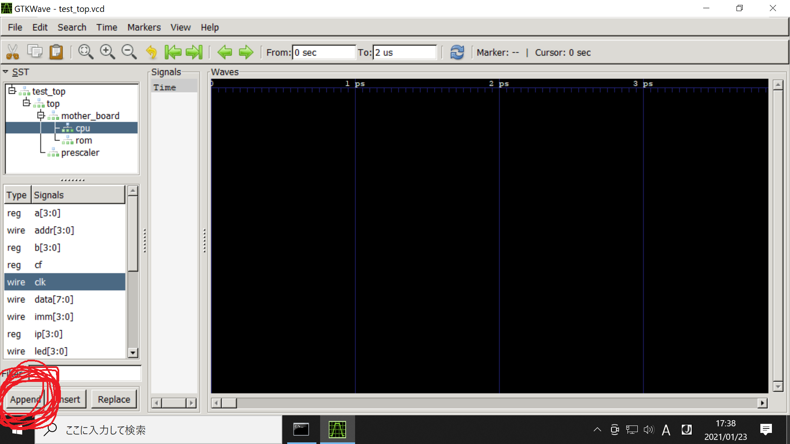

# Icarus Verilogのサポートページ

このページでは、フリーのハードウェア開発ツール

* Icarus Verilog
* GTKWave

を用いて本書のテストベンチを動かす方法について説明します。
これらのツールはMacOSやUbuntuでも動作しますが、以下ではWindows10を前提に説明します。

ここでの作業を終えれば、本書13ページのような電圧波形グラフが得られます。
しかし本書11,12ページのような回路図は得られません。
またFPGA評価ボードを使用できません。
そうした本格的な開発をお望みの方は [Vivadoを使った開発方法のページ](../vivado/index.md) をお読み下さい。

# Icarus Verilogのインストール

まず <http://bleyer.org/icarus/> を開いて、
`iverilog-v11-20201123-x64_setup.exe` をダウンロードして下さい。

01  


ダウンロードしたファイルを実行して下さい。

02  


以下のように `I accept the agreement`を選択して`Next`をクリックして下さい。

03  


以下のように`Next`をクリックして下さい。

04  


以下のように`Next`をクリックして下さい。

05  


以下のように`Next`をクリックして下さい。

06  


以下のように`Install`をクリックして下さい。

07  


以下のように`Finish`をクリックして下さい。

08  


これでCドライブ直下に Icarus Verilog と GTKWave がインストールされました。

# テストベンチの実行

まず下記リンクをクリックし、本書のソースコードをダウンロードして下さい。

<https://github.com/amane-uehara/cpubook-code/archive/master.zip>

zipファイルを解凍すると、以下4つのフォルダが得られます。
ここでは12章 (`chapter12`) のコードを動かしてみます。

09  


なおIcarus Verilogでは、本書の13章のコードを動かすことができません。
13章ではSystemVerilogの先進的な機能 (インターフェイスとか) を使用していますが、Icarus Verilogはこうした機能に対応していないのです。

さて `chapter12` には以下の3つのフォルダが含まれています。
このうち `board` のフォルダを開きます。

10  


以下の `icarus-verilog` のフォルダを開きます。

11  


`icarus-verilog` のフォルダには `test_top.sv` というファイルが含まれています。
これが今回動かしたいテストベンチのソ－スコードです。
開発ツールの都合上、本書143ページに記載した`test_top.sv`とは少し内容が異なっています。

さて `exec.bat` をダブルクリックすると、テストベンチが走り、波形ビューアーが立ち上がります。

12  


以下の画面 (GTKWave) が立ち上がれば成功です。

13  


補足ですが、今回実行した `exec.bat` の内容は下記3行のコマンドです。
LinuxやMacOSで実行する場合は、適宜シェルスクリプトに置き換えて下さい。

```cmd
C:\iverilog\bin\iverilog.exe -g2012 -o test_top.vvp test_top.sv ..\..\main\top.sv ..\..\main\prescaler.sv ..\..\main\mother_board.sv ..\..\main\mother_board\cpu.sv ..\..\main\mother_board\rom.sv
C:\iverilog\bin\vvp.exe -N test_top.vvp +vcd
C:\iverilog\gtkwave\bin\gtkwave.exe test_top.vcd
```

# 波形ビューアーの操作方法

ここからはCPU内部のワイヤーの電圧を見ていきます。
まず左上パネルの`test_top`モジュールをクリックして下さい。

14  


以下のように`mother_board`配下の`cpu`を選択します。
すると左下パネルに`cpu`モジュールのワイヤーが一覧表示されるので、そこから`clk`ワイヤーを選択します。

15  


以下のように`Append`ボタンをクリックすると、`clk`ワイヤーが電圧表示対象として登録されます。

16  


以下のように`Signals`のパネルに`clk`が追加されました。
これで`clk`の電圧変動が黒の波形パネルに表示されます。

17  


同様の手順でいくつかワイヤーを追加しました。
ここで虫眼鏡アイコン(`Zoom Fit`)をクリックすると、シミュレーション時間全体の波形が表示されます。

18  


以下のようにシミュレーション時間全体(0秒 - 2マイクロ秒)の波形が表示されます。
最初の時間帯に何が起きたのか見てみます。

19  


以下は0秒 - 250ナノ秒までのシミュレーション結果です。
グラフに添えられている数字は、複数ビットのワイヤーの電圧値を十六進数で表示したものです。

20  


なお波形の左端に、赤い線と`x`の文字が表示されます。
これは電圧が定まっていないことを表しています。
DFFの出力電圧は、`n_reset`がリセットするまで不定なのです。
詳細は本書の144ページを参照して下さい。
