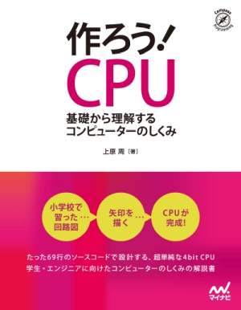
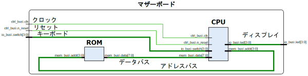
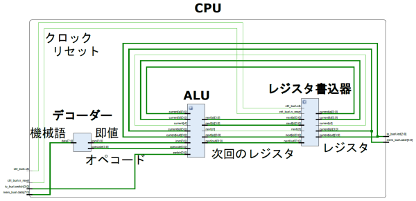
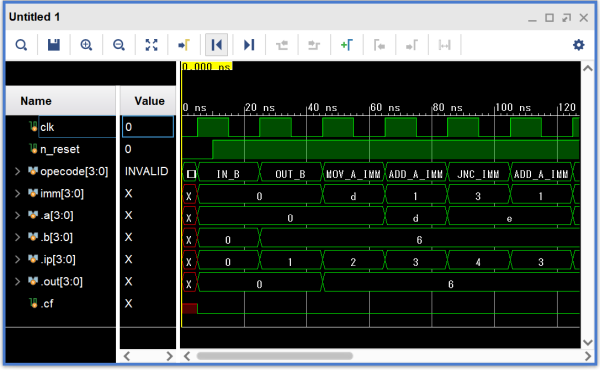

これはマイナビ出版の書籍

<a target="_blank" href="https://www.amazon.co.jp/gp/product/4839968519/ref=as_li_tl?ie=UTF8&camp=247&creative=1211&creativeASIN=4839968519&linkCode=as2&tag=tukuroucpu-22&linkId=1a4efec3926c4cd2cf5e72bee2e737de">作ろう！ CPU ～基礎から理解するコンピューターのしくみ～</a>

のサポートページです。



* 出版社へのリンク <https://book.mynavi.jp/ec/products/detail/id=116654>
* Amazonへのリンク <a target="_blank" href="https://www.amazon.co.jp/gp/product/4839968519/ref=as_li_tl?ie=UTF8&camp=247&creative=1211&creativeASIN=4839968519&linkCode=as2&tag=tukuroucpu-22&linkId=1a4efec3926c4cd2cf5e72bee2e737de">https://www.amazon.co.jp/gp/product/4839968519</a>

# 本書を購入して下さった方へ

買ってくださってありがとうございます。
感謝感謝です。
たぶん本書の11ページあたりを読んで、このサイトに来て下さったと思います。
そこで

[回路を動かす手順](howto/index.md)

↑
のリンクを開いて CPU を作り、FPGA で動かして下さい。

# 未購入の方へ

本書は CPU を作る本です。
コンピューターの頭脳と呼ばれる、あの CPU を自分で作るのです。
本書の特徴を並べます。

* 小学校レベルの回路から出発し、超単純な CPU (TD4) を作る。
* 電子回路についての事前知識は、一切不要。
* 抵抗や電流に関する数値の計算も、本書には登場しない。
* かわりに回路図に**「矢印を描く」**ことで、 CPU という物体を理解。
* 電子工作やハンダ付けのような作業も、一切不要。
* かわりにテキスト (ソースコード) で CPU を設計。
* **CPU のコード行数はわずか69行。** (12章のコードの行数)
* FPGA (USB で動く回路生成装置) で CPU の回路を実装。
* 作業開始から**約2時間で CPU が完成**し、機械語が動く。
* FPGA は約1万円で購入可能。開発環境ソフトは無料。
* FPGA を買わずにシミュレーター上で CPU を動かすことも可能。
* つまり書籍代以外は**無料で CPU が作れます**。

要するに、超初心者に向けた自作 CPU の解説本です。
他書よりはるかに丁寧に書きましたので、一冊目の入門本としてお薦めです。
しかし分かりやすさを追求した結果、完成する CPU が他書と比べてやや低機能になりました。
まず本書でコツをつかんでから、他書を参考に高機能な CPU を作るのが良いと思います。

実際に作る回路を見てみます。



上図は本書で設計するマザーボードを、FPGA 開発環境の回路図ビューアーで表示したものです。
CPU だけ作っても動かないので、マザーボードや ROM (メモリー) も作っています。
要するに本書は CPU だけでなく、コンピューター全体を設計して動かす本なのです。



上図は CPU 内部の回路図です。
まぁよく分からないと思いますが、本書を読めば全て分かります。



上図は CPU を動かしたときの、電圧変動のタイムチャートです。
さっぱり意味不明だと思いますが、上から3段目の`IN_B`とか`MOV_A_IMM`とか`ADD_A_IMM`は、いわゆる「機械語」というやつです。
本書を読めば CPU の言葉が分かるようになります。

<iframe style="width:120px;height:240px;" marginwidth="0" marginheight="0" scrolling="no" frameborder="0" src="https://rcm-fe.amazon-adsystem.com/e/cm?ref=qf_sp_asin_til&t=tukuroucpu-22&m=amazon&o=9&p=8&l=as1&IS1=1&detail=1&asins=4839968519&linkId=916b3d5ce6ebc0319c4f6521d8aeff8b&bc1=ffffff&lt1=_top&fc1=333333&lc1=0066c0&bg1=ffffff&f=ifr"></iframe>

# いろいろな方への紹介文

本書の想定読者は、電気や回路や CPU について何も知らない方です。
しかしそうでない様々な方にも本書を楽しんでいただきたいと思っています。
本書は、公理論的にゼロから論理回路の基礎を再構築し、それをできるだけ噛み砕いて分かりやすくまとめたものです。
既存の論理回路の教科書的とはストーリーがだいぶ違うので、回路に詳しい方にも新たな発見があるかもしれません。
様々なバックグラウンドの方に読んでいただくことを意図して執筆しました。

暇にあかせて10通りの紹介文をひねり出したので、興味のある項目に目を通してもらえると幸いです。

* [電気や回路を全然知らない方へ](https://amane-uehara.github.io/cpubook/#電気や回路を全然知らない方へ)
* [プログラマーの方へ](https://amane-uehara.github.io/cpubook/#プログラマーの方へ)
* [情報学科の学生さんへ](https://amane-uehara.github.io/cpubook/#情報学科の学生さんへ)
* [論理回路を教えておられる先生方へ](https://amane-uehara.github.io/cpubook/#論理回路を教えておられる先生方へ)
* [FPGAに挫折した経験のある方へ](https://amane-uehara.github.io/cpubook/#FPGAに挫折した経験のある方へ)
* [ハードウェア記述言語に詳しい方へ](https://amane-uehara.github.io/cpubook/#ハードウェア記述言語に詳しい方へ)
* [アナログ回路に詳しい方へ](https://amane-uehara.github.io/cpubook/#アナログ回路に詳しい方へ)
* [物理に詳しい方へ](https://amane-uehara.github.io/cpubook/#物理に詳しい方へ)
* [数学に詳しい方へ](https://amane-uehara.github.io/cpubook/#数学に詳しい方へ)
* [人間の欲望を重視する方へ](https://amane-uehara.github.io/cpubook/#人間の欲望を重視する方へ)

# 電気や回路を全然知らない方へ

本書のメインの対象読者は、CPU や電子回路について全然知らない方です。
コンピューターに関しては「マザーボードの上に CPU とメモリーが載っている」ぐらいの知識があれば十分です。
プログラミングについては無経験でも大丈夫ですが、「関数・変数・代入・if文」あたりを知っていると多少役に立ちます。

本書は基礎を大変重視しています。
小学校レベルの豆電球の回路から、CPU まで、一歩ずつ真面目に丁寧に解説していきます。
そのため他の CPU 自作本と比べると、完成する CPU の機能はやや劣ります。
高機能な CPU が作りたい方は、とりあえず一冊目に本書を読んで、その後で他書にチャレンジするのが良いと思います。

CPU を作る上で必要なものは、Windows のパソコンだけです。
Linux でも構いません。
Mac だと動かすのに多少苦労するかもしれません。
とにかくパソコンがあれば、自作 CPU の回路をシミュレートできます。

さらに FPGA 評価ボードという「回路生成装置」を購入すれば、本書の回路を実際に製作して動かすことができます。
これはパソコンの USB 機器で、1万円ほどで購入できます。
ハンダゴテやピンセットは一切不要です。
とりあえず本書を片手にシミュレーターで遊んで、興味が湧いたら FPGA 評価ボードを買うと良いと思います。

# プログラマーの方へ

本書で作るのは、TD4と呼ばれている 4bit の CPU です。
能力については、以下のC言語のコードが動きます。

```c
int main(void) {
  int a, b;
  b = read_switch(); // キーボードの値を読み取る関数

  do {
    led(b);          // ディスプレイに値を表示する関数

    a = 13;
    do {
      a = a + 1;
    } while (a < 16);

    b = b + 1;
  } while (b < 16);

  do {
    led(0);
    led(15);
  } while (true);

  return 0;
}
```

コードの内容はさておき、一応それなりのプログラムが動く CPU なのです。
この動作のしくみが回路レベルで理解できれば、日常的に書いておられるコードが動く様子もだいたい理解できると思います。

ちなみに本書では、System Verilog という言語を使って CPU の回路図を記述します。
これはプログラミング言語ではなく、ハードウェア記述言語と呼ばれるもので、関数型言語の親戚です。
多くの方にとって馴染みが薄いと思われるので、本書ではハードウェア記述言語について多くのページを割いて解説しています。

ハードウェア記述言語の知識は一生モノです。
数十年前から回路パーツは全く変わっておらず (小さくなっただけ) 、回路図を記述する言語にも大した変化はありませんでした。
情報科学の最底辺レイヤーで、物理層と密着しているので、めったなことでは変わらないのです。
web 系のように一瞬で知識が陳腐化する心配がないので、習得するとオトクだと思います。

# 情報学科の学生さんへ

お疲れさまです。
多くの学校では、ブール代数・2進数・加算器などを教わった後に、いきなり「ハードウェア記述言語で CPU を作れ」という課題が降ってくるようです。
そして右も左もわからないまま、とりあえず適当にコードを書いてコンパイルすると、一応それっぽく動いたので、単位はもらえそう、みたいになるようです。
しかし何だかモヤモヤとした気持ちが残ってしまいます。

あなたは悪くありません。
ハードウェア記述言語という馴染みのないものを、ろくな事前知識のないまま押し付けられても、混乱して当たり前です。
そこで本書が役立つのです。
これを読めば、ハードウェア記述言語 (System Verilog) についてしっかり理解できます。
とりあえず本書の4章から7章まで読めば、迷うことなく System Verilog が書けるようになります。

「ウチの学校では System Verilog じゃなくて Verilog HDL を使う」という方でも、本書は役に立つと思います。
Verilog HDL の文法は (私見ですが) 極めて醜悪で、それをきれいに整備した後継言語が System Verilog です。
遠回りのようですが、まず先に System Verilog の文法を知った上で、Verilog HDL を書く方が楽だと思います。
「ウチの学校では VHDL を使わされる」という方についても、本書の知識が無駄になることはないでしょう。
言語の見た目は異なりますが、結局のところ、論理回路を記述するという点は共通しているからです。

# 論理回路を教えておられる先生方へ

本書は「もし自分が論理回路学の担当教員だったらどんな講義内容にしようか」と考えて執筆しました。
既存の教科書の説明を全て忘れて、ストーリーをゼロから再構築したつもりです。
これまで必須とされてきた話題であっても、不要だと判断すれば躊躇なく削除しています。

そもそも従来の論理回路の教科書は、組合回路に偏重しすぎていたと筆者は考えています。
具体的には、NANDの完備性・カルノー図・QM法といった話題です。
これらはブール代数を基礎とする秀麗な理論で、説明したくなる気持ちはよく分かります。
しかし「それが論理回路の基礎なのか？」と考えると、やや的を外しているように筆者には見えるのです。

かつて汎用ロジック IC が広く使われていた時代は、組合回路の最適化について習熟する必要がありました。
人力で組合回路を論理圧縮するために、最適化アルゴリズムの細部を詰める必要があったからです。
しかしHDLが普及するにつれ、論理圧縮はコンパイラの仕事になりました。
組合回路の最適化技法を習得する必要性は、昔と比べて大きく下がっています。

ところでHDLは有向グラフを記述する言語です。
プログラミングパラダイムがデータフロー型なので当然といえます。
この背後には「論理回路は有向グラフだ」という思想があります。
これこそ、論理回路の基礎であると筆者は考えています。
そこで本書では

* 小学校で習う電池と抵抗の回路は、無向グラフだ
* しかし論理回路は、有向グラフだ
* この「向き」の正体は何なのか？

という疑問からスタートして、「向き付け可能な回路」を論理回路と定義します。

組合回路については、DAG で定義します。
これをトポロジカルソートして、HDLの知識に基づいて式木(Expression Tree)に変換し、動作が純粋関数になることを示します。
また組合回路の設計は「真理値表を書く」という話題に置き換えて議論します。

順序回路についても、グラフ構造に基づいて系統的に説明します。
もちろん天下り的にミーリー型回路やムーア型回路を与えることはしません。
論理回路に対し、「カオス性を持たない」という条件を課すことで、自然にミーリー型回路を導出し、さらに再帰性を課してムーア型回路を導出します。
そしてムーア型回路の具体例として、 単純な 4bit CPU を設計し、ハードウェア記述言語でコーディングして、シミュレーターと FPGA で動かします。

# FPGAに挫折した経験のある方へ

多くの初心者が FPGA に挫折する原因は、ハードウェア記述言語 (HDL) の解説本のせいだと筆者は考えています。
初心者向けを謳う大抵の解説本には、

「コードを書く際にどのような回路が生成されるか想像せよ」

みたいなことが書かれています。
しかし具体的に、何をどう想像すればよいのか、まるで説明がありません。
これはそもそも考え方の方向が誤っています。
HDL を正しく理解したければ、まず第一に

「この回路を作りたい！」

という回路図を用意すべきです。
紙に回路図を描くのです。
そして (本書の4.1節で導入する) アルゴリズムに沿って回路図を分解し、その各パーツをソースコードに置換すれば、自動的に正しい HDL が生成されます。
本質的なポイントは、作りたい回路を用意するところだけです。
その後のコーディングは純然たる作業で、頭を悩ませる必要はありません。

HDL を理解する上で重要なポイントは、以下の2つを分けて考えることです。

1. 回路の構造
2. 電圧の動作

前者が重要です。
回路図を、電気や電圧と何の関係もない純粋な「絵」だと考えて下さい。
この絵を描くためのペイントツールが HDL なのです。
本書はこうした立場で System Verilog (HDLの一種) を解説しています。

# ハードウェア記述言語に詳しい方へ

ある程度 HDL (System Verilog) に詳しい方なら、本書の内容は自明に感じることばかりです。
具体的には以下のような内容が書かれています。

* 論理回路は、電池 (電源) を根とする根付き木である
* そのため特殊な事情がない限り、ドライバは1本にする
* 組合回路は DAG なので、トポロジカルソートすると手続き的に記述できる
* `always_comb`ブロックは真理値表である

本書の特色は、トランジスタから RTL まで、首尾一貫して「有向グラフ」を意識して説明していることです。
そもそもハードウェア記述言語はデータフロー型言語であり、つまり有向グラフを記述するための言語です。
これを意識している論理回路の本が、(筆者の知る限り) 見当たらないので、本書を執筆しました。

# アナログ回路に詳しい方へ

本書は FPGA 使用を前提として書かれています。
そのため論理回路の「芯」の部分しか扱っていません。
つまりアナログにまつわる難しい話題は、全て無視しています。
具体的にはスイッチのチャタリングやドライバの駆動能力、寄生容量や寄生インダクタンスといった話題を扱っていません。
これらについては、本書の元となった書籍「CPUの創りかた」に秀逸な説明があるので、詳細は割愛しています。
本書の回路図を見ると腹が立つかもしれませんが、許していただけると幸いです。

別軸の言い訳ですが、何を作るにせよ、まずは原理的な「ミニマルなモデル」を知るのが重要だと筆者は考えています。
その後で「愚直に作ると動かなった」という挫折を経て、「安定的に動かすにはどうすればよいのか」という境地に達するのが健全だと思います。
本書はミニマルなモデルを説明するだけで手一杯でした。

# 物理に詳しい方へ

筆者も物理出身なのですが、IT 業界で働くことになりました。
そこで情報科学の基礎を理解するため、論理回路の本を数冊読みました。
当然ですが、どの本も「情報処理装置をいかにして回路実装するか?」というモチベーションで書かれていました。
これは一見分かりやすいのですが、しかし筆者には不満が残りました。
各論としては理解できるのですが、それらを統括する普遍的な物理・数理が見えてこなかったのです。

論理回路について深く理解するには、むしろ逆に「物理から出発して情報処理装置を作る」という立場で議論を進めるべきだと筆者は感じました。
階層構造的に考えると、下側の物理レイヤーを基礎として、上側の情報レイヤーを策定していくのが自然でしょう。
本書はそうした期待に答えるための本です。
以下では本書の理論構成を物理的な立場で説明します (詳細は本書の付録を参照) 。

まず電子回路に含まれる全ワイヤーの電位のリストを、状態と定義します。
電池や抵抗といったパーツは、電位に対する拘束条件と見なせます。
そして拘束条件を満たす状態を全て集めたものを、相空間と定義します。
解析力学における相空間と同じようなものだと思って下さい。
論理回路の場合は状態が離散化されるので、相空間が有限集合になります。

この相空間に時間発展のフローを入れます。
すると相空間の各点をノードとする有向グラフが得られます。
この解軌道は有向グラフのパスに対応します。
重要なポイントは解軌道の力学的安定性です。
例えばカオス的な解軌道が存在する場合、回路を操作したときの電圧変動が予測不能になってしまいます。

こうした不安定性は、回路の設計時に適切なルールを導入することで除去できます。
要するに回路の形を制限するのです。
そして全ての不安定性を取り除けば決定論的に動作する回路が得られます。
本書では、この決定論的な回路クラスを CPU と定義しています。

ここまでくれば、あとは人間の欲望のまま機能 (乗算器とか) を追加することで、どんどん便利な CPU に成長していきます。
そうした応用方面の話題については、既に多くの書籍が出版されているので、本書ではほとんど扱っていません。
また回路設計における最適化技法についても、必要最小限の記述にとどめました。
あくまで基礎的な話題に絞って、物理と情報をしっかり繋ぐことだけを念頭においています。

# 数学に詳しい方へ

本書は「論理回路の背後にひそむ数理構造を明瞭に整理したい」と考えて執筆しました。
「どうせブール代数のことだろう」と思うかもしれませんが、主眼はそこではありません。
むしろブール代数でわりきれない部分を整理したかったのです。
以下では議論の概要を説明します (詳細は本書の8.9節と付録を参照) 。

本書では一般的な電子回路を、ワイヤーを介してパーツ同士を繋いだ無向グラフとして定義します。
そこに段階的に「良い性質」を導入することで、特殊な回路クラスを定義していきます。
特に「電圧の二値性」と「向き付け可能性」を満たす回路を、論理回路と定義します。
また回路内の全ワイヤーの電圧値のリストを、回路の状態と定義します。
回路に含まれるスイッチを操作すると、状態が遷移します。
これは状態遷移図で表現できます。

ここで回路の幾何が効いてきます。
回路図で表現されるパーツ間の接続情報は、回路における位相幾何情報といえます。
そこで捨象されたワイヤーの長さなどの情報は、ある種の微分幾何情報といえます。
この位相構造と微分構造が、それぞれ状態遷移図のノードとエッジに対応するのです。

また一般に、論理回路の状態遷移は確率過程になります。
つまり遷移にランダムネスが含まれるのです。
このままでは決定論的に動く計算機が作れません。
そこで条件を追加すると、決定性の状態遷移図を持つ論理回路が得られます。
この回路クラスこそ、世間で CPU と呼ばれているものです。

以上がざっくりとした議論の流れです。
一般から特殊に向かって段階的にルールを追加し、CPU を導出する本なのです。
メインの対象読者は数学に強い人ではないので、ほとんどの議論は具体例だけで済ませています。
また筆者自身、それほど数学に強いわけではないので、厳密に考えるとヤバい箇所が残っているかもしれません。
査読を受けた原稿でもないので、眉に唾をつけて読んでいただけると幸いです。

# 人間の欲望を重視する方へ

普通の論理回路の教科書は「人間の欲望」に沿って議論を進めています。
例えば以下のような感じです。

* 数を扱いたい → 二進数を使おう
* 足し算したい → 加算器を作ろう
* 数を数えたい → カウンタを作ろう
* 状態機械がほしい → ミーリー型回路を作ろう

一方、本書は「回路そのもの」に注目して議論を進めます。
そのため以下のようなストーリー構成に仕上がっています。

* 2色で着色できる回路は? → 並列抵抗回路
* 向き付け可能な回路は? → 論理回路
* 向きが反転しない回路は? → 論理ゲートの回路
* 向きがループしない回路は? → 組合回路
* 安定性を持つ回路は? → ミーリー型回路
* 再帰性を持つ回路は? → ムーア型回路

要するに人間を排除することで、論理回路の本質を見極めたいのです。
しかし最終的に作る CPU は、人間の欲望の塊のような装置です。
この欲望は究極的に、CPU の命令セット (ISA) に集約されます。
こうした人間的な話題を後半の章に隔離することで、ストーリー全体の見通しを良くしています。

回路設計の歴史を振り返ると、その根本に人間の欲望があったと思います。
本書はそうした歴史や文化を蔑ろにする本です。
因習にとらわれず、ひたすら数理的整合性だけを突き詰めて、簡単に全てを理解した気分になるための本といえます。

# その他

* 更新履歴: <https://github.com/amane-uehara/cpubook/commits/master>
* マイナビ出版のページ: <https://book.mynavi.jp/supportsite/detail/9784839968519.html>
* バグ・誤植の報告先: <https://github.com/amane-uehara/cpubook/issues>
