### 作業の目次

1. [Vivadoのダウンロード](../download/index.md)
2. [Vivadoのインストール](../install/index.md) <------- (here)
3. [Vivadoへのデバイス情報の追加](../board/index.md)
4. [プロジェクトの作成](../project/index.md)
5. [回路図の表示](../schematic/index.md)
6. [電圧シミュレーション](../wave/index.md)
7. [ソースコードのコンパイル](../compile/index.md)

[目次のページに戻る](../vivado/index.md)

# 注意

このページの内容は古くなっています！！！

最新版については
[Vivado 2021のインストール方法のページ](../install_vivado2021/index.md)
をご参照下さい。

# Vivado 2020のインストール

インストーラーのダウンロードが完了したら、クリックして開きます。

1  
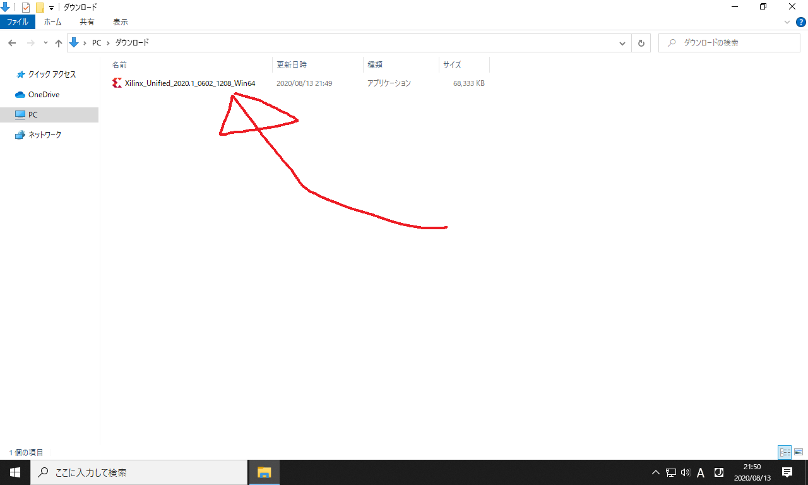

以下の画面が開くので、`Next`をクリックします。

2  
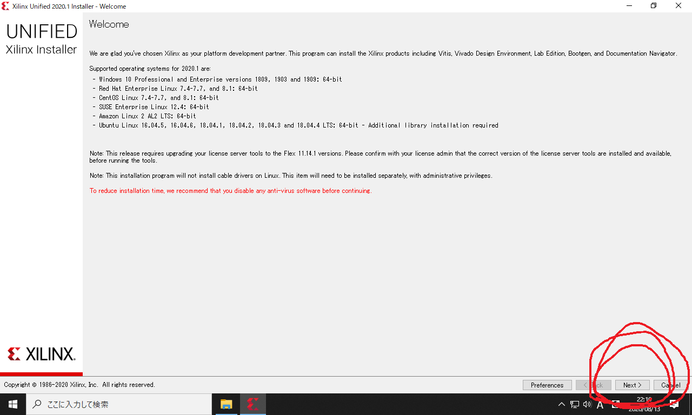

以下のアカウント認証画面が開きます。
`User ID` は Xilinx アカウント作成時に登録したメールアドレスです。
`Password` も Xilinx アカウント作成時に登録したものを入力します。

3  
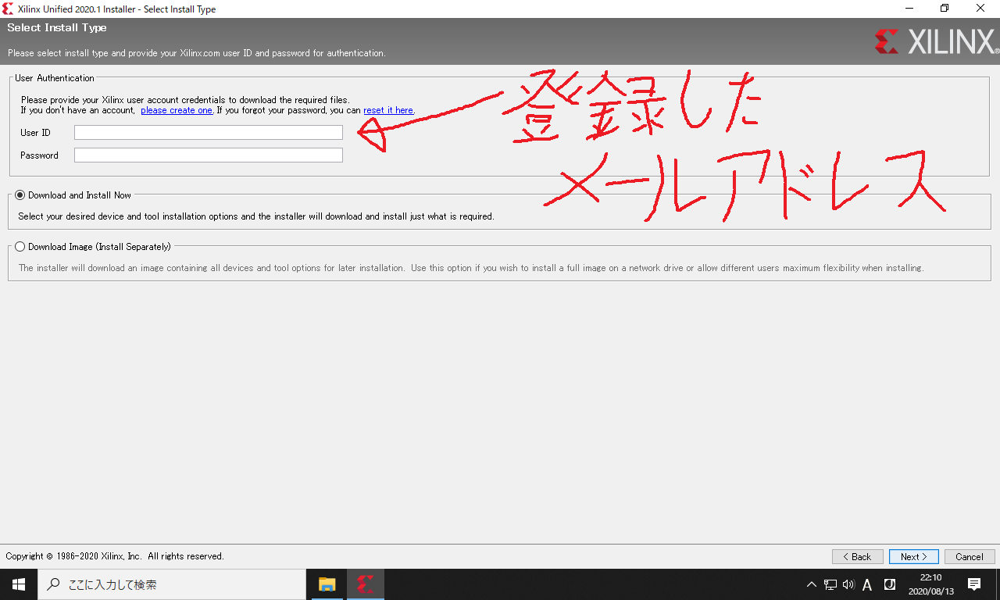

入力を終えたら`Next`をクリックします。

4  
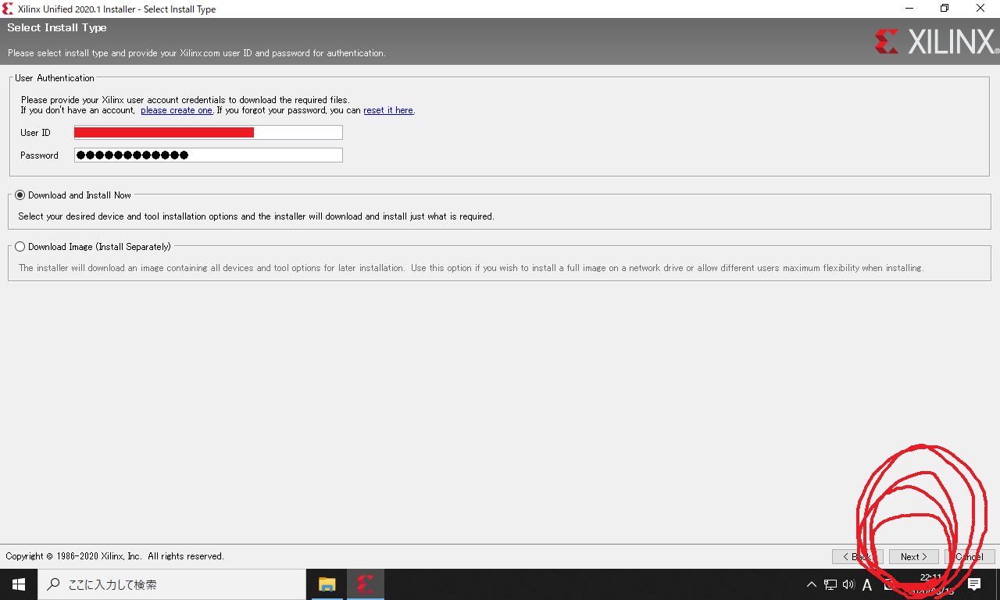

以下のライセンスの同意確認画面が開きます。
以下の3箇所が空白になっているので、チェックします。

5  
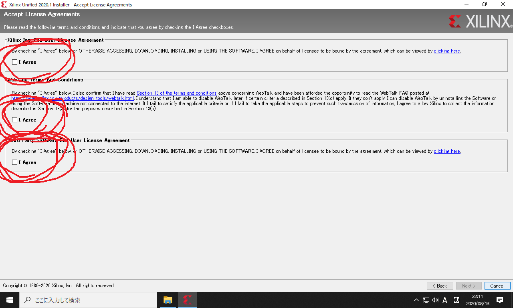

チェックしたら`Next`をクリックします。

6  
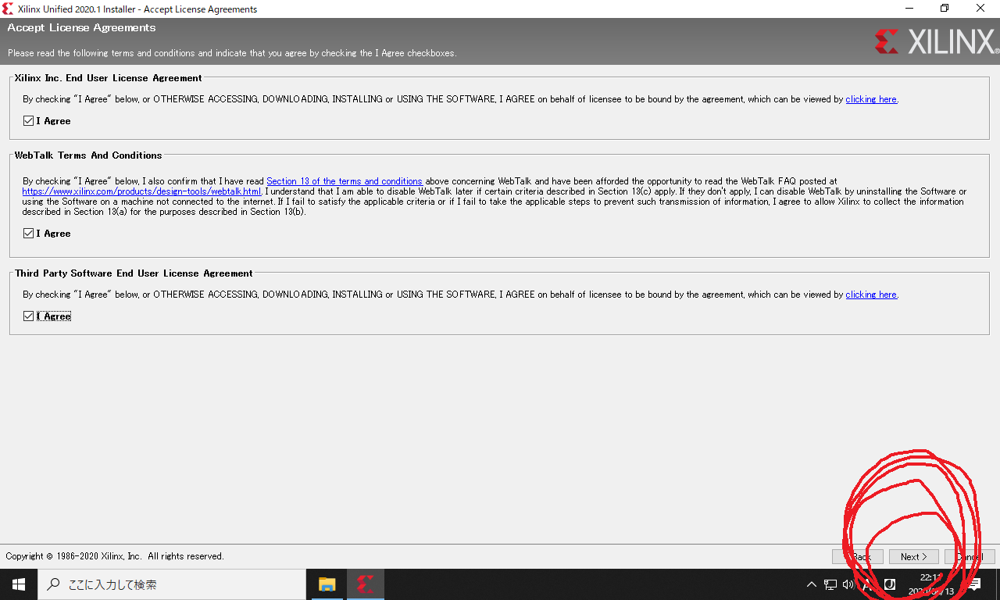

以下のインストール内容の選択画面が開きます。
デフォルト値 (`Vitis`) のままでOKです。
本当に欲しいものは2番目の`Vivado`なのですが、`Vitis`の中に含まれています。

7  
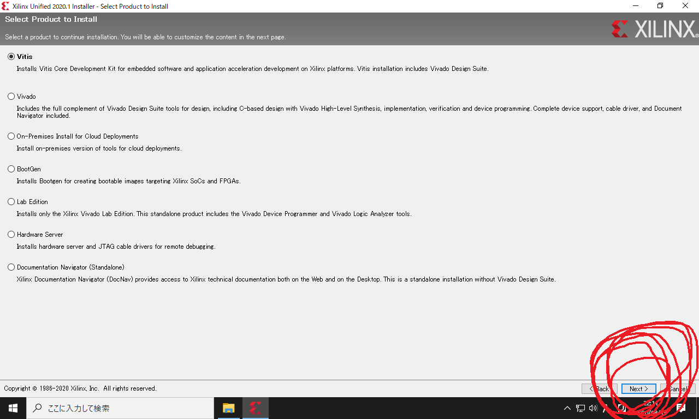

以下のダウンロード内容の選択画面が開きます。

* ハードディスクの容量が余っている場合は、デフォルトの設定値のままでもOKです。その場合のダウンロードサイズは30GB、インストールサイズは110GBになります。
* ダウンロードサイズを減らす場合は、`Devices` の中から不要なチェックを外します。 `7 Series` だけを残して下さい。

8  
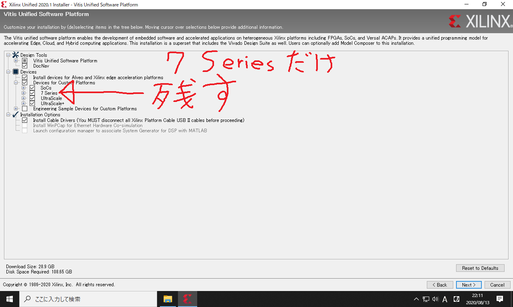

以下の設定前千名歴、ダウンロードサイズが14GB、インストールサイズが67GBに減ります。
これで`Next`をクリックします。

これでもサイズが大きすぎる場合は、右下の`Back`のボタンを押して、`Select Product to Install`のページに戻って下さい。
そして`Vivado`を選択し、次のページで`Vivado HL WebPACK`を選択し、その次のページで`Devices`内を`7 Series`だけにして下さい。
これでダウンロードサイズが10GB、インストールサイズが35GB程度まで削減できます。

9  
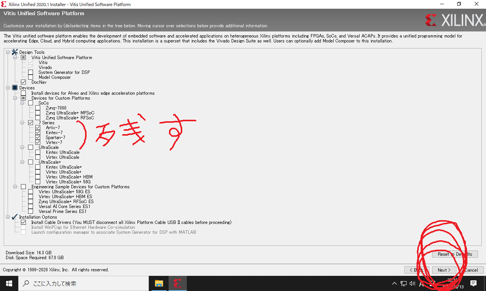

Vivadoのインストール場所と、使用できるユーザーを設定します。
ここはデフォルトの設定のまま Next を押してOKです。

10  
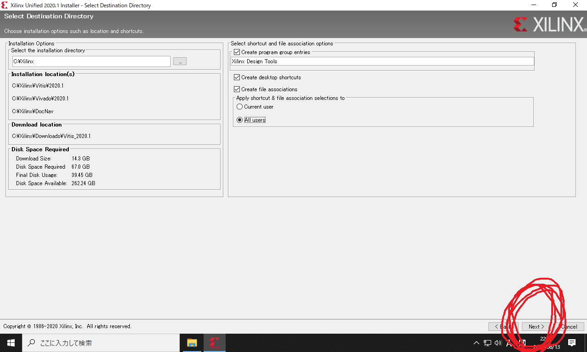

ディレクトリの作成確認に`Yes`と答えます。

11  
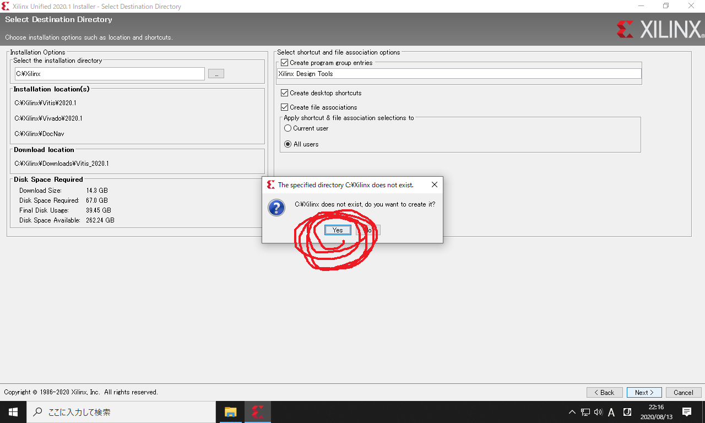

以下の最終確認画面が開きます。
サイズが大きいので、パソコンの記憶容量を確認してディスクがあふれないことを確かめて下さい。
ここで`Install`をクリックすると、統合開発環境本体のダウンロードが始まります。

12  
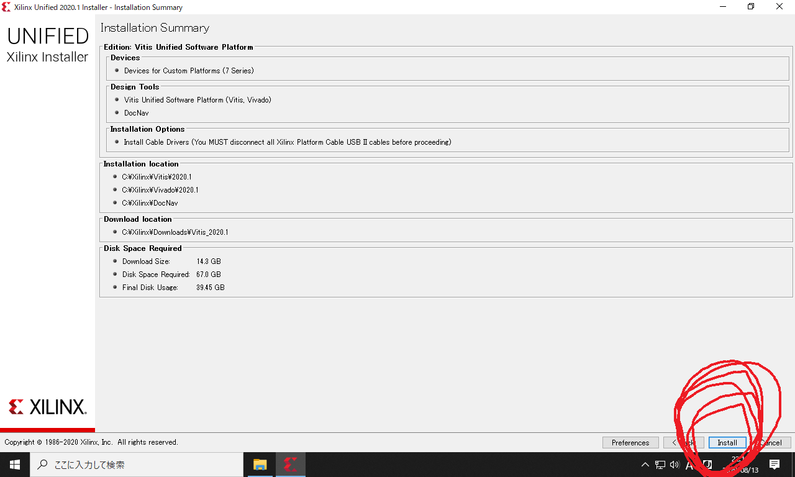

ダウンロードとインストールが始まります。
しばらく待ちます。

13  
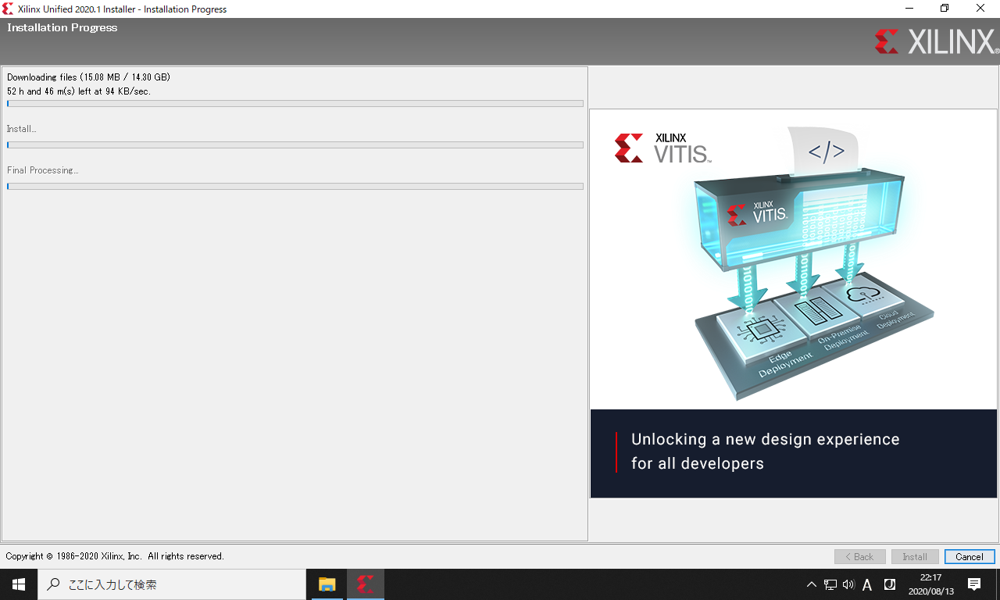

インストールが完了すると、デスクトップに以下のショートカットが生成されます。

14  
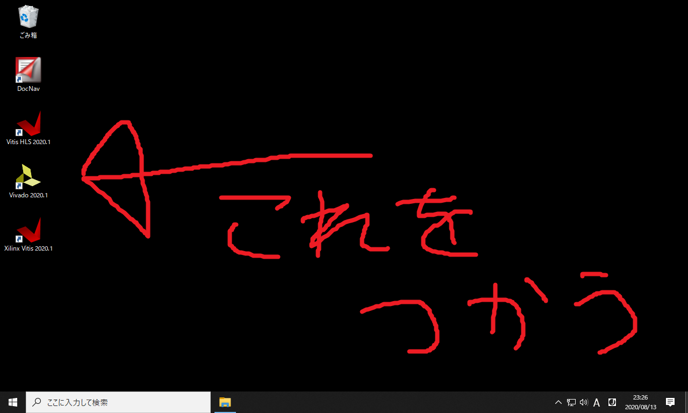

このうち使用するのは黄色のアイコン (`Vivado`) だけです。
起動できるかどうか、一応確かめて下さい。
なお起動時に「Could not locate Quick Help files. Quick Help will not be available.」という警告が出ることがありますが、実害はありません。

起動が確認できたら終了してOKです。
引き続き
[Vivadoへのデバイス情報の追加](../board/index.md)
に進んで、デバイスファイルを追加して下さい。
