# Vivado2021のインストール

Vivado2021のインストーラーをダウンロードします。
ダウンロード方法の詳細は
[こちら](../download/index.md)
のページをご参照下さい。

1  
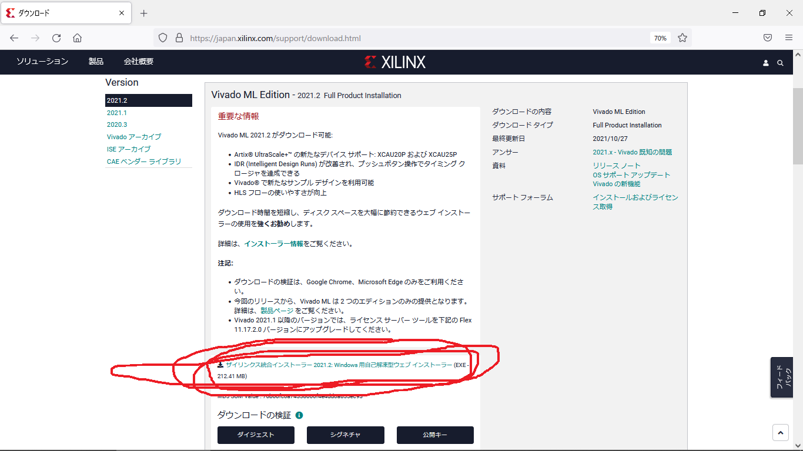

ダウンロードが完了したら、クリックして開きます。

2  
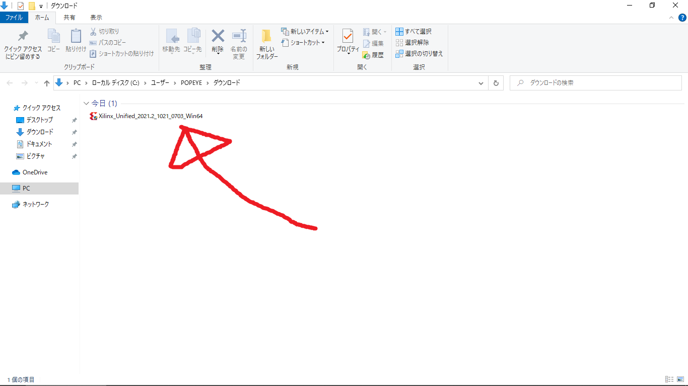

以下の画面が開くので、`Next`をクリックします。

3  
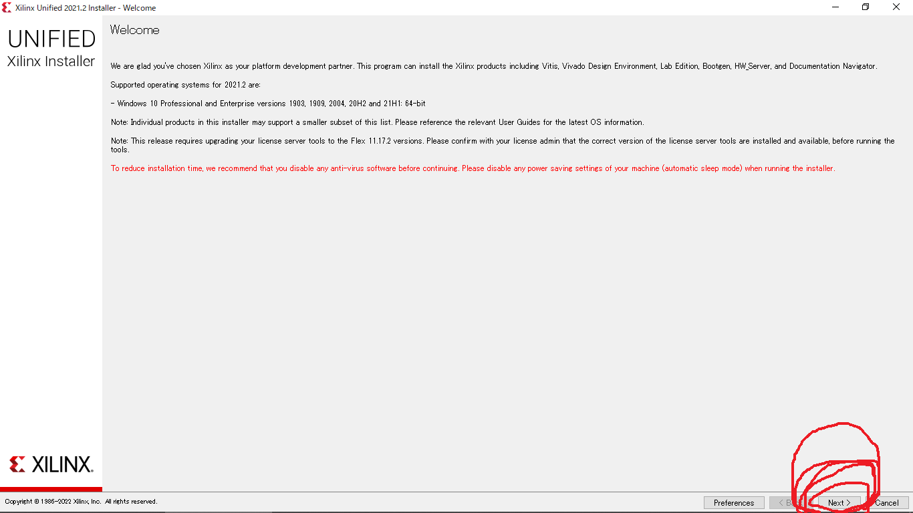

以下のアカウント認証画面が開きます。
`User ID` は Xilinx アカウント作成時に登録したメールアドレスです。
`Password` も Xilinx アカウント作成時に登録したものを入力します。

4  

入力を終えたら`Next`をクリックします。

5  
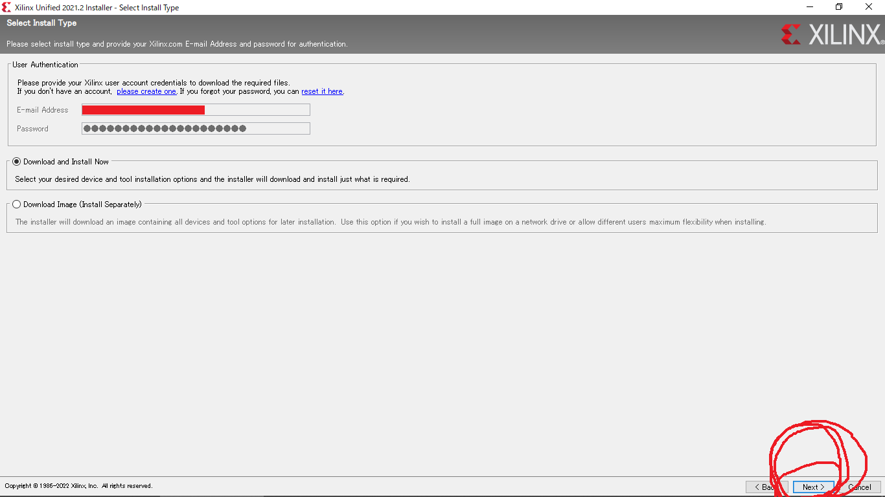

以下のインストール内容の選択画面が開きます。
`Vivado`を選択します。

6  
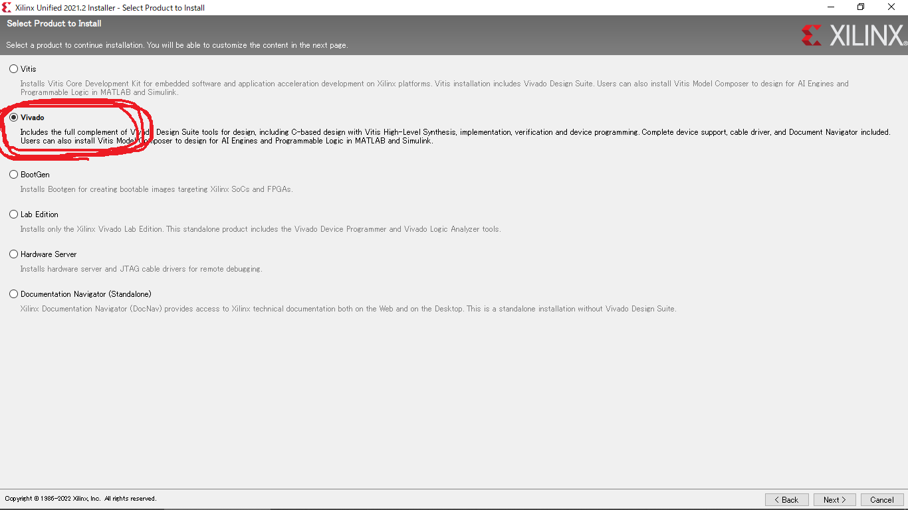

チェックしたら`Next`をクリックします。

7  
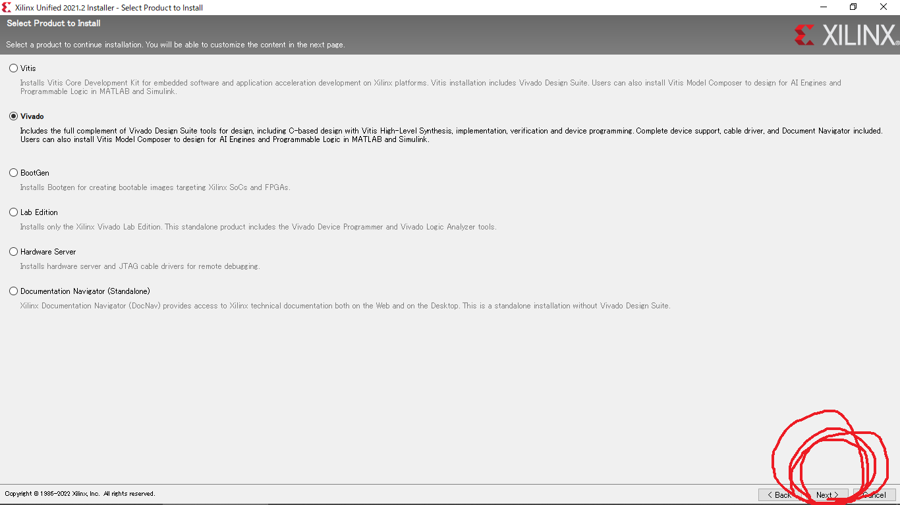

インストールするVivadoの種類が表示されるので、`Vivado ML Standard`を選択します。

8  
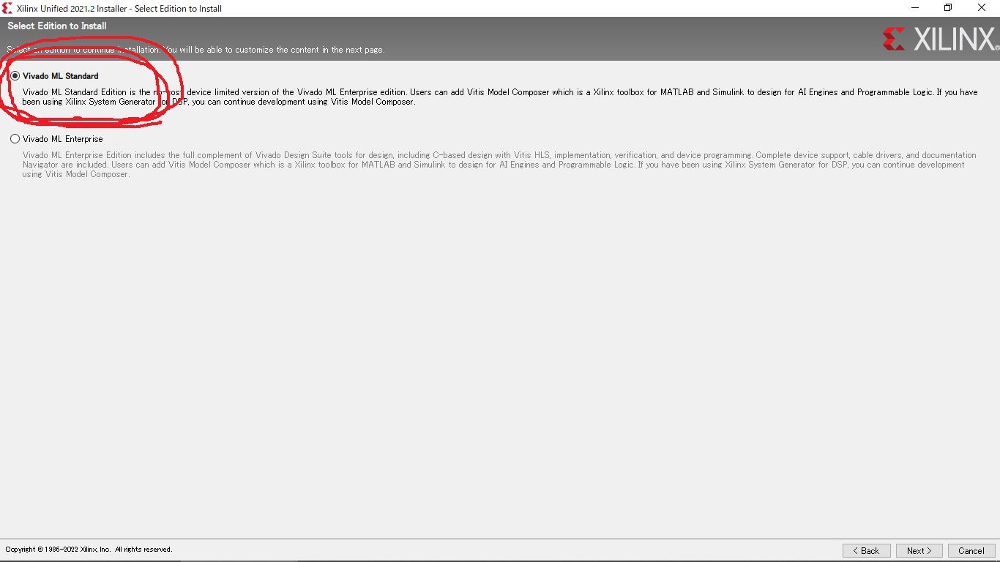

チェックしたら`Next`をクリックします。

9  
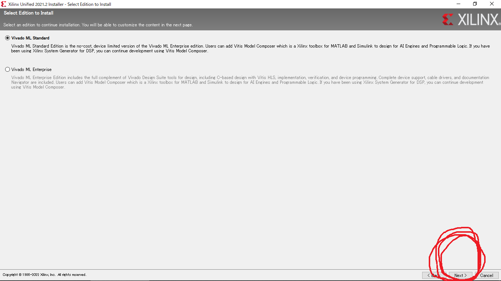

インストールする内容のチェックリストが表示されます。以下はデフォルトの設定です。

10  
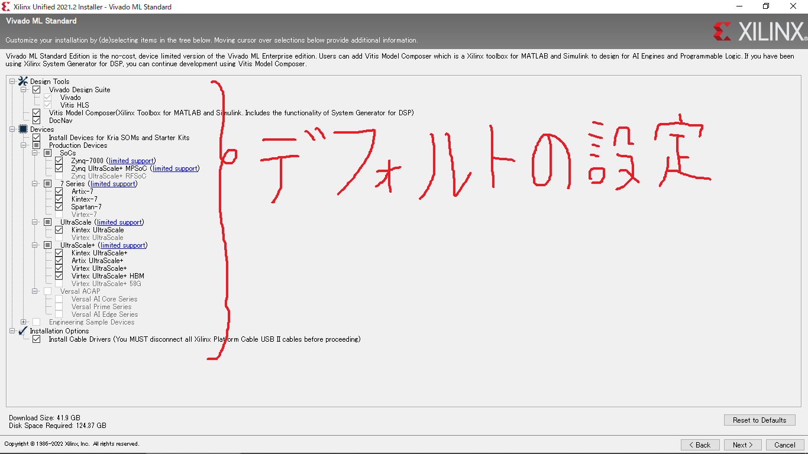

以下のように必要な項目だけチェックを残せば、インストール容量を削減できます。
今回は`Arty-S7-50`というFPGA評価ボードを動かしたいので、`Devices`のところを`7-Series`だけ残しました。

11  
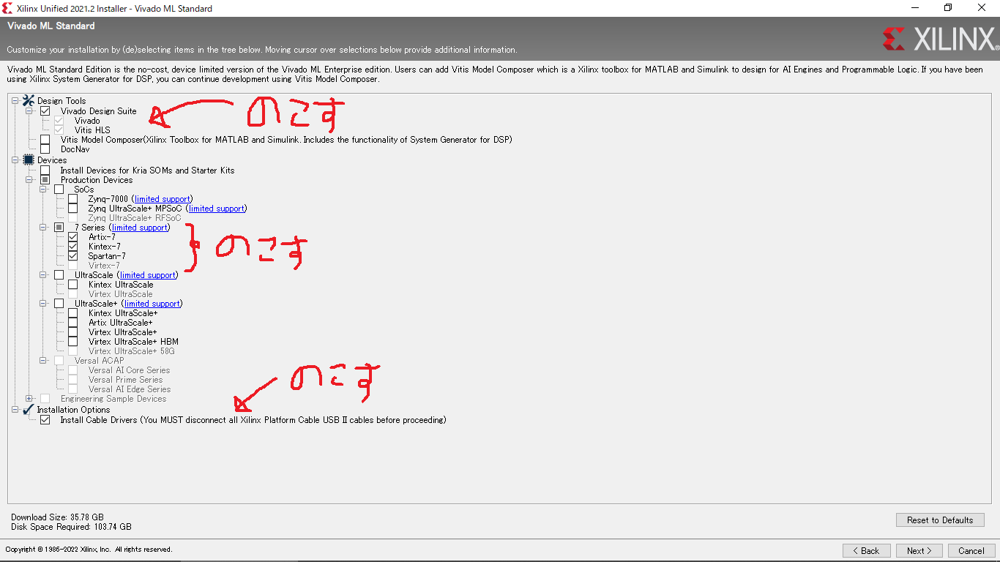

以下のライセンスの同意確認画面が開きます。
以下の2箇所が空白になっているので、チェックします。

12  
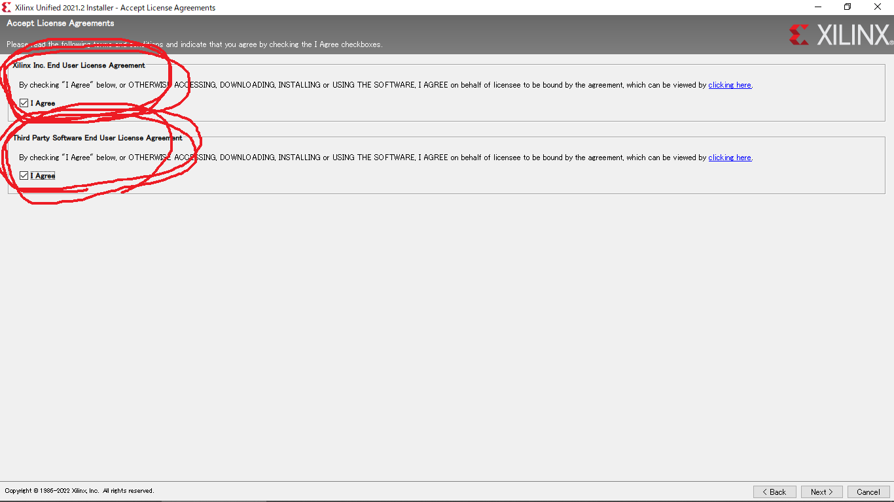

チェックしたら`Next`をクリックします。

13  
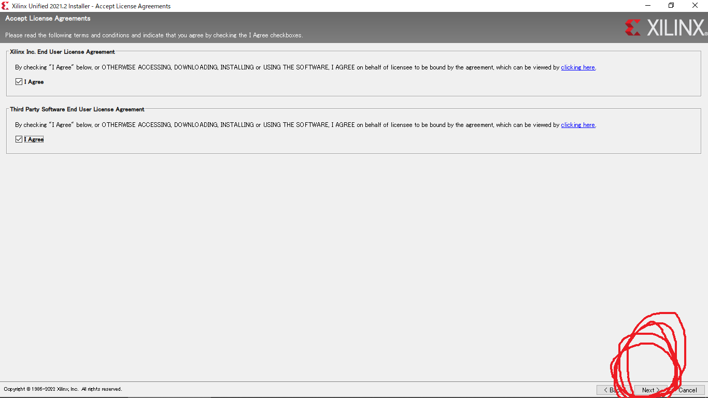

Vivadoのインストール場所と、使用できるユーザーを設定します。
ここはデフォルトの設定のまま Next を押してOKです。

14  
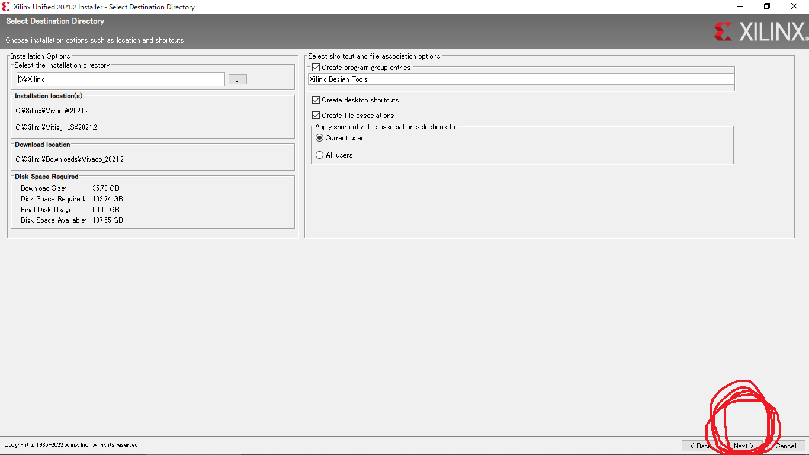

ディレクトリの作成確認に`Yes`と答えます。

15  
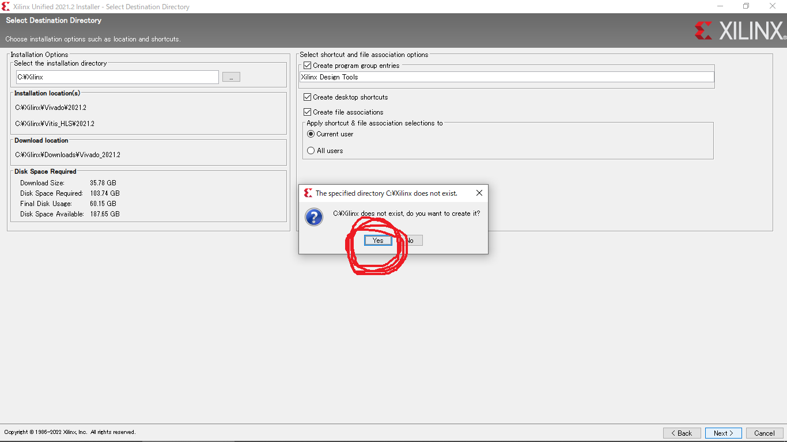

以下の最終確認画面が開きます。
サイズが大きいので、パソコンの記憶容量を確認してディスクがあふれないことを確かめて下さい。
ここで`Install`をクリックすると、統合開発環境本体のダウンロードが始まります。

16  
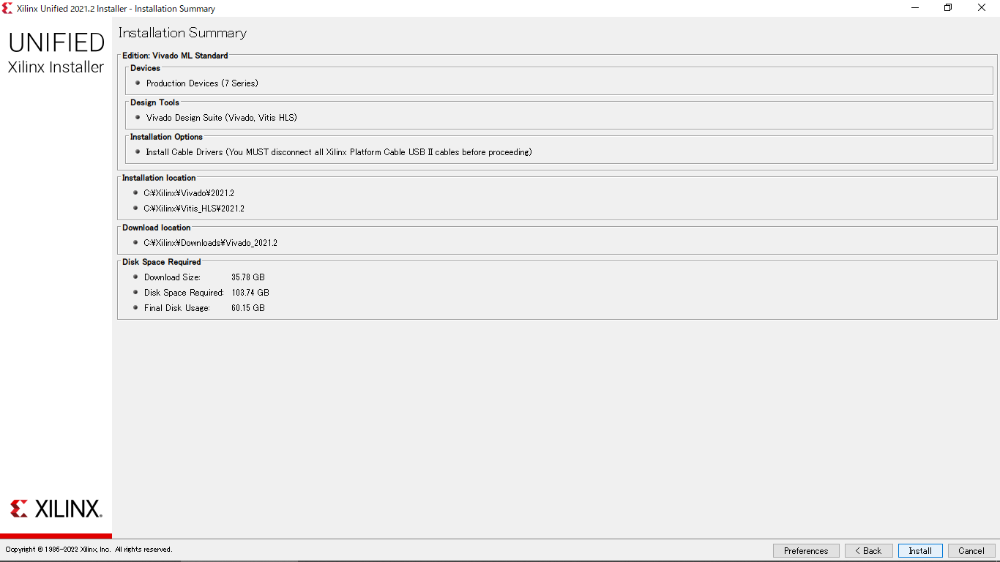

ダウンロードとインストールが始まります。
しばらく待ちます。

17  
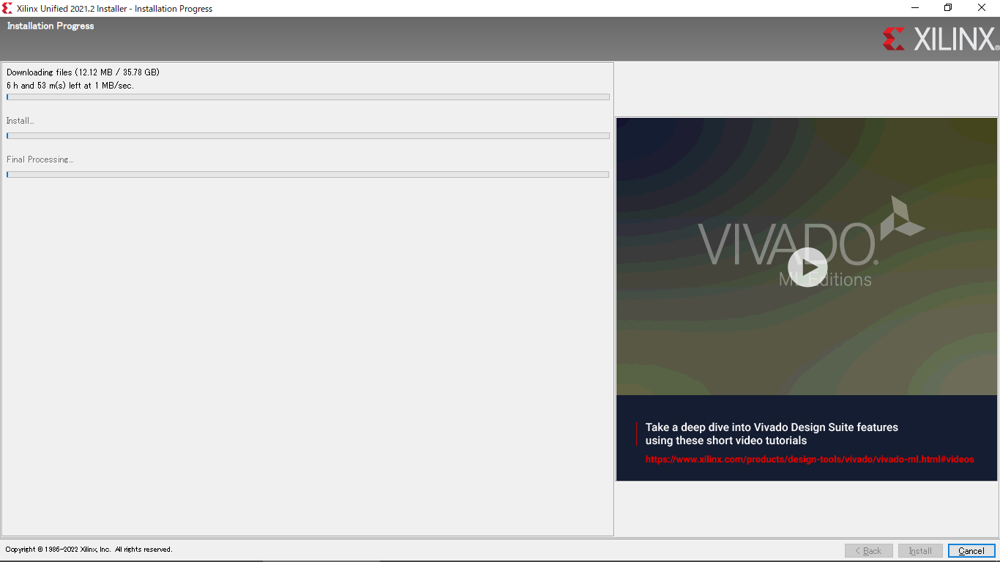

インストールが完了すると、デスクトップに`Vivado`のアイコンが生成されます。
なお起動時に「Could not locate Quick Help files. Quick Help will not be available.」という警告が出ることがありますが、実害はありません。

起動が確認できたら終了してOKです。
引き続き
[Vivadoへのデバイス情報の追加](../board/index.md)
に進んで、デバイスファイルを追加して下さい。
