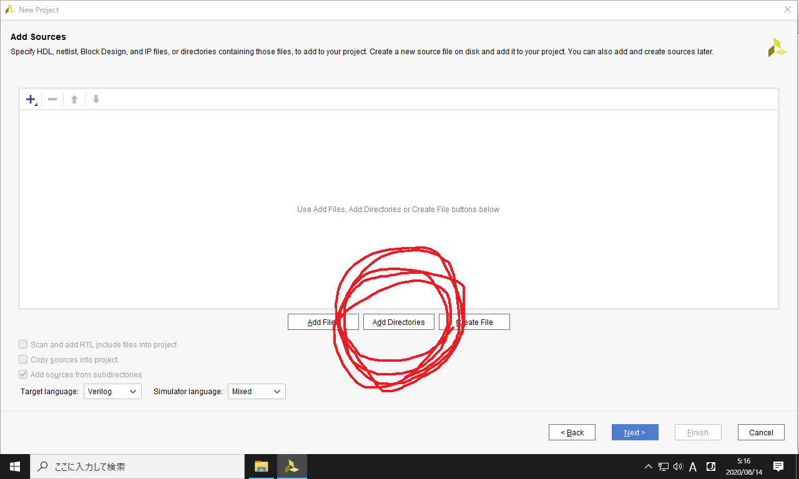
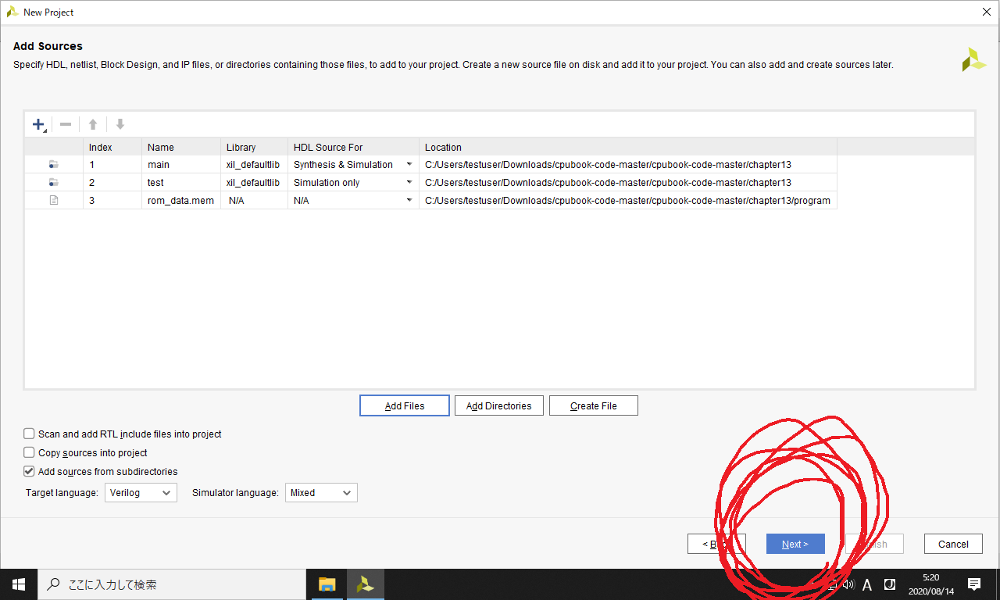
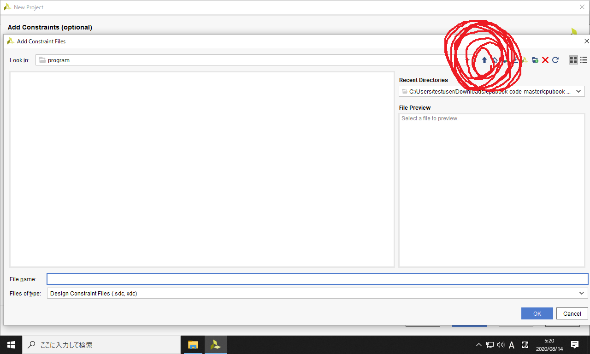
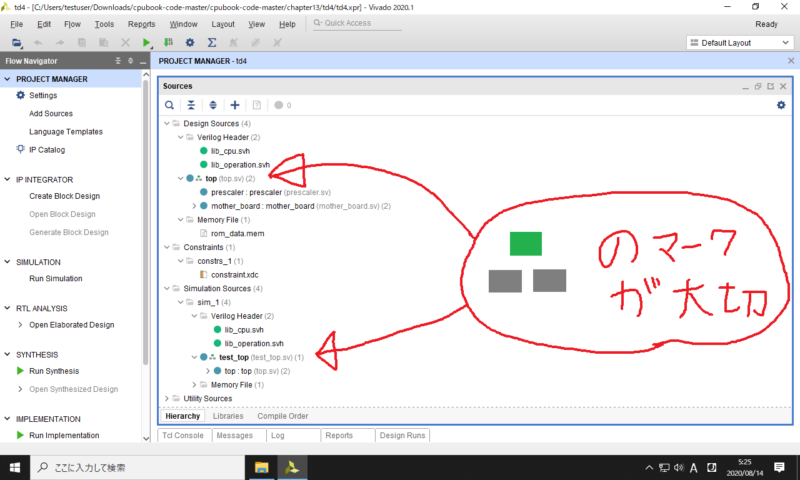

### 作業の目次

1. [Vivadoのダウンロード](../download/index.md)
2. [Vivadoのインストール](../install/index.md)
3. [Vivadoへのデバイス情報の追加](../board/index.md)
4. [プロジェクトの作成](../project/index.md) <------- (here)
5. [回路図の表示](../schematic/index.md)
6. [電圧シミュレーション](../wave/index.md)
7. [ソースコードのコンパイル](../compile/index.md)

[目次のページに戻る](../howto/index.md)

# プロジェクトの作成

以下ではソースコードをVivadoに登録する方法について説明します。

### ソースコードのダウンロード

まず下記リンクのzipファイルを左クリックしてダウンロードします。

<https://github.com/amane-uehara/cpubook-code/archive/master.zip>

`cpubook-code-master.zip`というファイルが得られるので、解凍します。

01  

以下のように、ダウンロードフォルダの中に `cpubook-code-master` というフォルダが存在する前提で話を進めていきます。
このフォルダの中身を見てみます。

02  

以下のように `chapter09` と `chapter10` と `chapter12` と `chapter13` という4つのフォルダが詰まっています。
これは本書の9章から13章のソースコードです。

以下では `chapter13` の動かし方を説明します。まずフォルダの中身を確認します。

03  

`chater13`の中には、以下の4つのフォルダが含まれています。

04  

各フォルダについて説明すると

|         |説明                                               |ファイル形式  |
|:--------|---------------------------------------------------|--------------|
|`board`  |`main`の中身と、FPGA評価ボードを繋ぐための設定     |tcl           |
|`main`   |回路図のコード。ハードウェア記述言語で書かれている |System Verilog|
|`program`|回路図のコードの一部。ROMに載せる機械語が入っている|十六進数      |
|`test`   |`main`をデバッグするためのコード                   |System Verilog|

以下ではこれらを、さっきインストールした Vivado に登録していきます。

### Vivadoにソースコードを読み込む

デスクトップの Vivado 2020.1 のショートカットをクリックして、 Vivado を起動します。

05  

以下の画面が立ち上がるので、`Create Project`をクリックします。

06  

以下のようなウィンドウが開くので、`Next`をクリックします。

07  

プロジェクトの名前と場所を設定します。
まず`Project location`の右側の`...`のボタンを押します。

08  

以下のように、さっきダウンロードしたソースコードのフォルダのパス(`chapter13`)を指定します。

09  

`Project name`は好きに設定してOKです。
ここでは`td4`という名前にして、`Next`をクリックします。

10  

以下のプロジェクト種類の選択画面が開きます。
デフォルトの`RTL Project`のまま`Next`をクリックします。
(RTLはResister Transfer Levelの略称で、要するにハードウェア記述言語で書かれたプロジェクトということです。)

11  

以下のソースコードの追加画面が開きます。
まず回路図のコードを追加します。
左下のTarget Languageが`Verilog`になっていることを確認してから、`Add Directories`をクリックします。

12  

以下のように、`chapter13`内の`main`フォルダを選択して`Select`を押して下さい。
これで`main`フォルダ以下の全ソースコードが再帰的に読み込まれます。

13  

次に電圧シミュレーション用のテストベンチを登録するため、再び`Add Directories`をクリックします。

14  

以下のように`test`のフォルダを選択し、`Select`を押して下さい。

15  

さらに以下の下三角のボタンを押して下さい。

16  

以下の`Simulation Only`を選択して下さい。

17  

次に自作CPU上で走らせるプログラムを登録するため、`Add Files`をクリックします。

18  

フォルダの階層を上がるため、以下の上矢印のボタンをクリックします。

19  

`chapter13`のフォルダ階層で、以下の`program`のフォルダを開きます。

20  

以下のように`Files of type`のところをクリックし、`Memory initialization Files`を選択して下さい。
この項目が見当たらない場合は、項目画面を上の方にスクロールして下さい。

21  

以下のように`rom_data.mem`のファイルを選択し、OKボタンを押して下さい。

22  

`main`と`test`と`rom_data.mem`が以下のように登録されていることを確認し、`Next`ボタンを押して下さい。

23  

次にConstraints (制約ファイル) を登録します。
以下の`Add Files`をクリックして下さい。

24  

以下の上矢印ボタンを押して、フォルダ階層を上がります。

25  

`chapter13`に含まれる`board`フォルダをクリックします。

26  

以下のように、`board`内にはいくつかのフォルダが存在します。

27  

使用するFPGA評価ボードに応じて、次のようにフォルダを開いて下さい。

|                         |開くフォルダ        |
|:------------------------|:-------------------|
|FPGA評価ボードが無い場合 |`xilinx-arty-s7`    |
|Arty-S7-25 を使う場合    |`xilinx-arty-s7`    |
|Arty-S7-50 を使う場合    |`xilinx-arty-s7`    |
|Arty を使う場合          |`xilinx-arty`       |

説明の都合上、以下では Arty-S7-50 を使うと想定して話を進めます。

フォルダを開いたら、その中の`constraint.xdc`ファイルを選択してOKをクリックして下さい。

28  

以下のようにウィンドウ内に`constraint.xdc`が追加されていることを確認し、`Next`ボタンを押します。

29  

以下のFPGA評価ボードの選択画面が現れます。
まず`Boards`タブを選択して下さい。

30  

使用したいFPGA評価ボード名を、以下の検索窓に入力します。

31  

例えば検索窓に arty s7 と入力すると、以下のようになります。

32  

`Arty S7-50` を使う場合は、以下のように行の色を反転させて、`Next`ボタンを押します。
まだFPGA評価ボードを購入していない方も、とりあえず `Arty S7-50` を選択して下さい。

33  

以下の最終確認画面が表示されます。

* 15 source files will be added.
* 1 constraints file will be added.

と表示されていることを確認し、`Finish`ボタンを押します。

34  

プロジェクトが作成され、以下の画面が開きます。

35  

ファイルが正しく登録されていることを確認するため、以下のように `Sources` のパネルを最大化して下さい。
そして以下の画像に一致することを確かめて下さい。

36  

重要なポイントは、`top`と`test_top`の左側に
∴
のような記号が存在することです。
もし見当たらなければ、以下のように右クリックして`Set as Top`を選択して下さい。
(この設定の意味については、本書131ページの手順3を参照して下さい。)

37  

これでソースコードの登録が完了しました。
引き続き [回路図の表示](../schematic/index.md) のページに進んで下さい。
