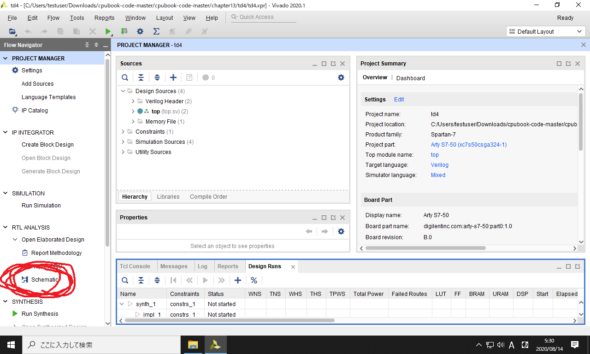
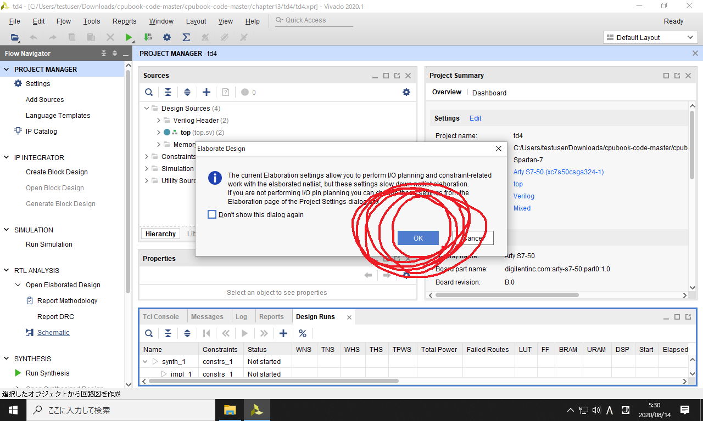
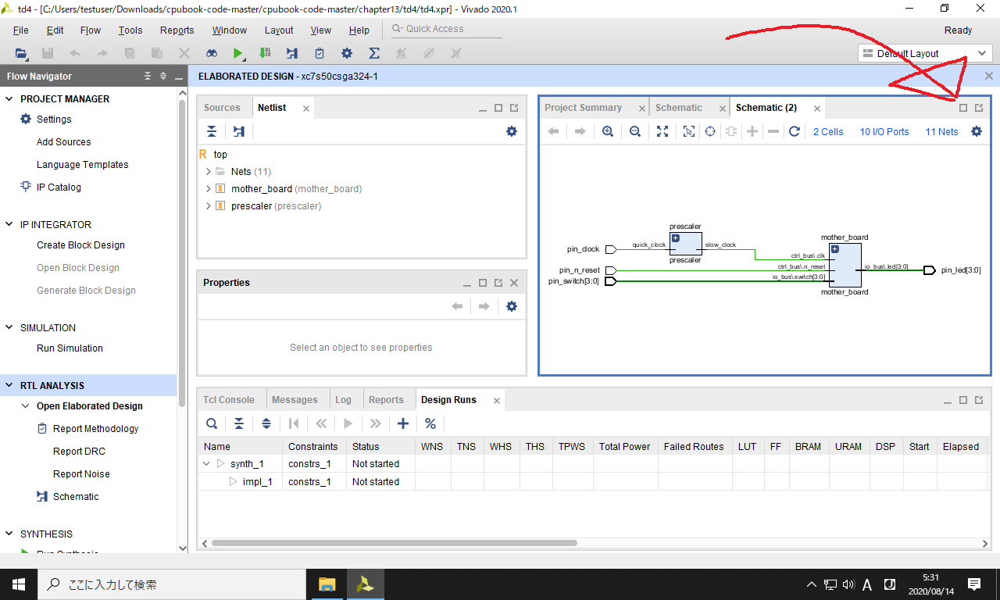
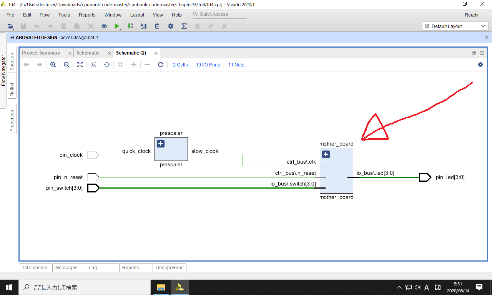
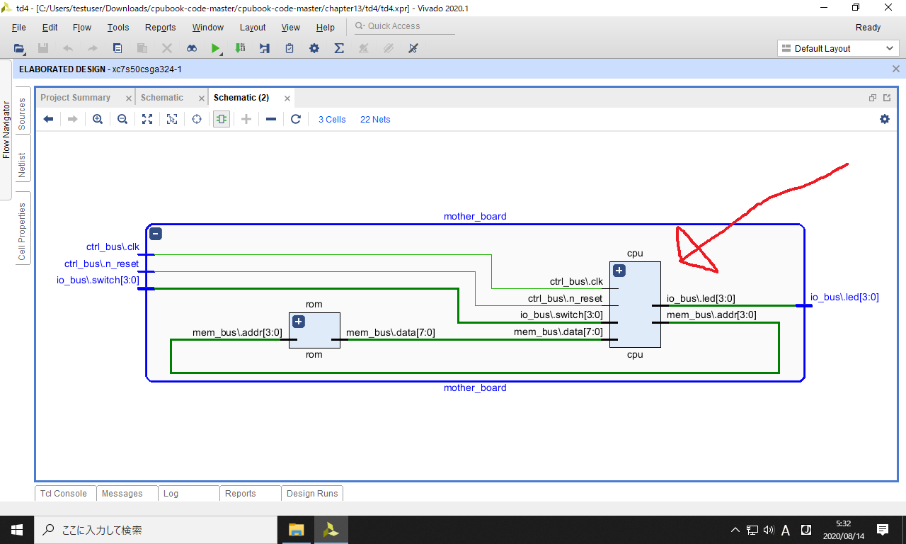
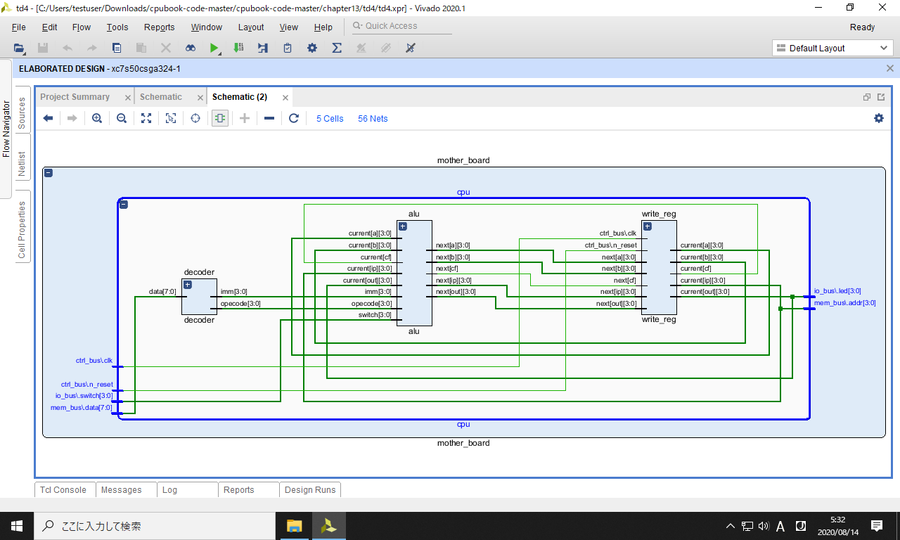

### 作業の目次

1. [Vivadoのダウンロード](../download/index.md)
2. [Vivadoのインストール](../install/index.md)
3. [Vivadoへのデバイス情報の追加](../board/index.md)
4. [プロジェクトの作成](../project/index.md)
5. [回路図の表示](../schematic/index.md) <------- (here)
6. [電圧シミュレーション](../wave/index.md)
7. [ソースコードのコンパイル](../compile/index.md)

[目次のページに戻る](../vivado/index.md)

# 回路図の表示

左側パネルの`RTL ANALYSIS`に含まれる`Schematic`をクリックします。

01  

以下のダイアログが表示されるので、OKボタンを押します。

02  

しばらくすると回路図が表示されます。
しかし小さくて見にくいので、以下のように最大化します。

03  

回路図が大きくなりました。
ここでは`mother_board`をダブルクリックして、内部の実装を見てみます。

04  

以下のように、マザーボードの内部が表示されます。
これは本書の11ページの回路図と同じものです。

さらに内部の`cpu`をダブルクリックして、内部の実装を見てみます。

05  

以下のように、CPUの内部が表示されます。
これは本書の12ページの回路図と同じものです。

06  

本書内の回路図はワイヤーの配置を整えていますが、モジュール間の接続関係は今回の回路図と同じです。

引き続き [電圧シミュレーション](../wave/index.md) のページに進んで下さい。
