### 作業の目次

1. [Vivadoのダウンロード](../download/index.md)
2. [Vivadoのインストール](../install/index.md)
3. [Vivadoへのデバイス情報の追加](../board/index.md)
4. [プロジェクトの作成](../project/index.md)
5. [回路図の表示](../schematic/index.md)
6. [電圧シミュレーション](../wave/index.md) <------- (here)
7. [ソースコードのコンパイル](../compile/index.md)

[目次のページに戻る](../howto/index.md)

# 電圧シミュレーション

左側パネルの`SIMULATION`に含まれる`Run Simulation`をクリックします。
そして`Run Behavior Simulation`を選択します。
これは重い処理なので、開くのに少し時間がかかります。

01  
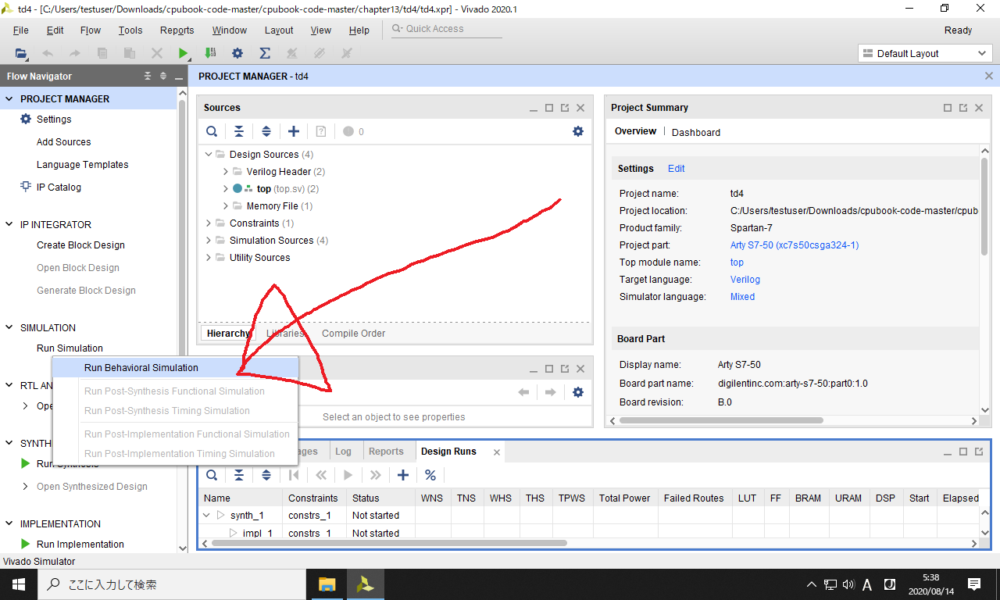

以下の画面が表示されるので、`top`を開きます。

02  
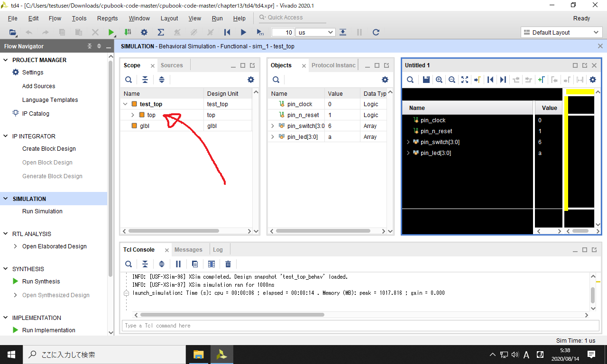

以下のように、`mother_board`に含まれる`cpu`のところで右クリックします。
そして`Add to Wave Window`を選択します。

03  
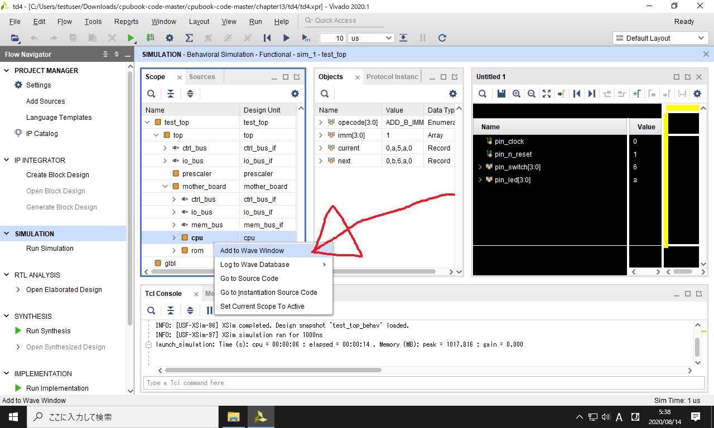

右側の黒のパネルに`opecode`や`imm`が追加されました。
これらの電圧を見るために、黒のパネルを最大化します。

04  
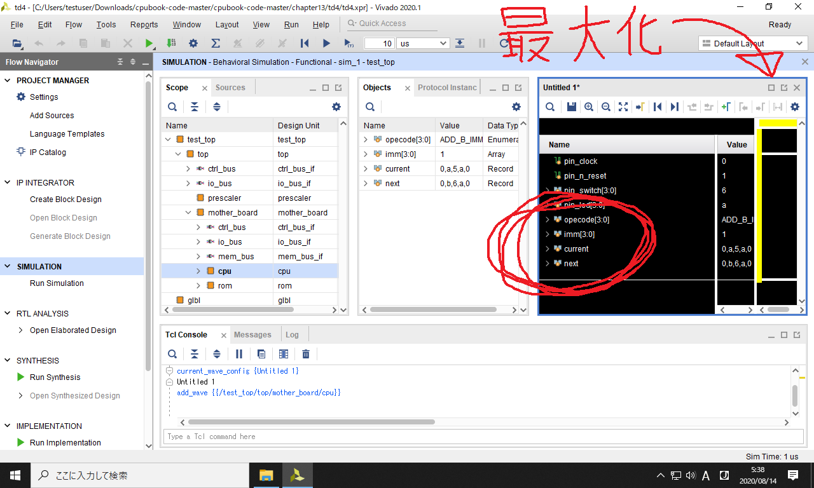

また以下のように、シミュレーションを開始時点に戻すボタンを2回クリックします。

05  
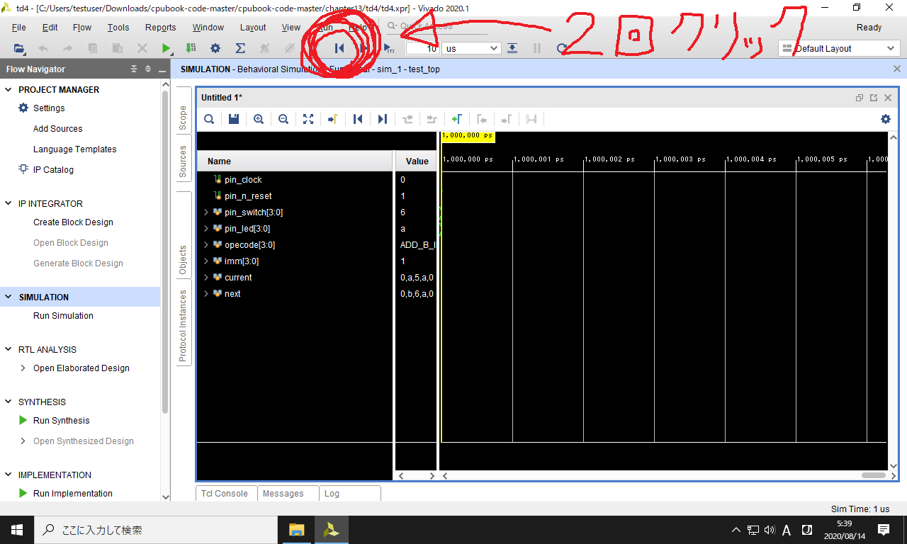

そして以下のシミュレーションの実行ボタンを押します。

06  
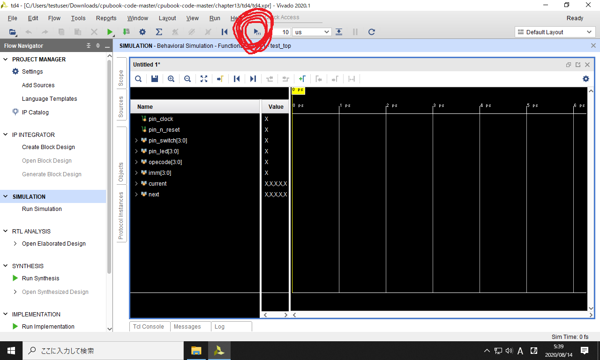

シミュレーションを実行すると、以下の画面に遷移します。
これはテストベンチ内の`$finish()`の命令により、シミュレートの対象時間が 2 us で終了したことを表しています。
このあたりの詳細は、本書の141ページあたりで説明します。

タイムチャートの画面に戻るには、左上の`Untitled`のタブをクリックします

07  
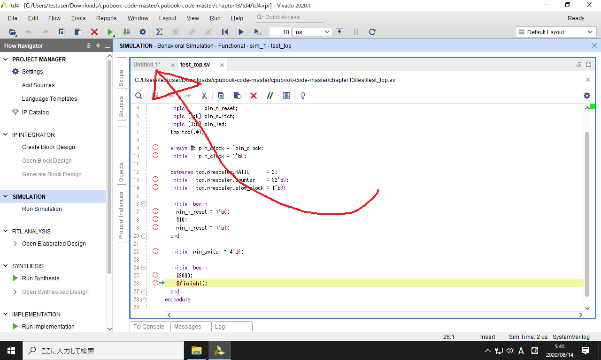

以下のようにシミュレーション結果が表示されます。
これは電圧波形のタイムチャートで、詳細は本書の90ページで説明します。

全期間のシミュレーション結果を見るには、以下の`X`っぽいボタンを押します。

08  
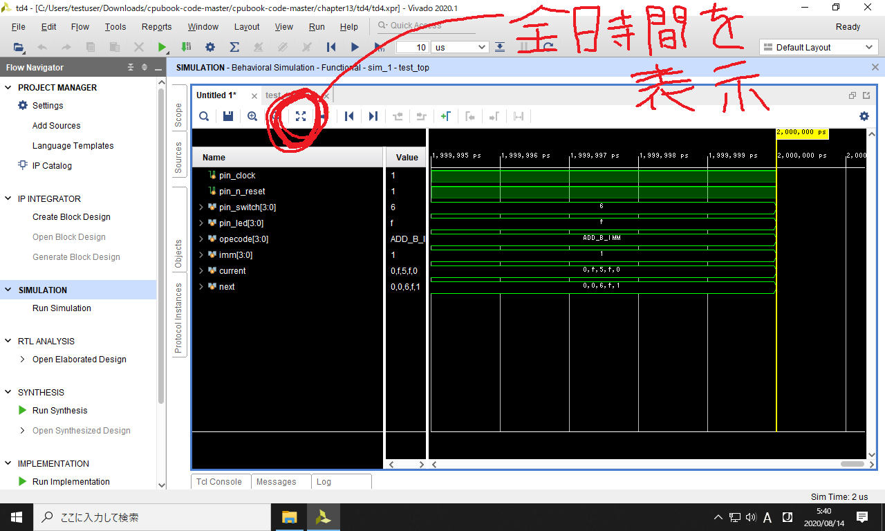

シミュレーションの一部の時間を拡大して表示するには、以下の虫眼鏡のボタンを押します。

09  
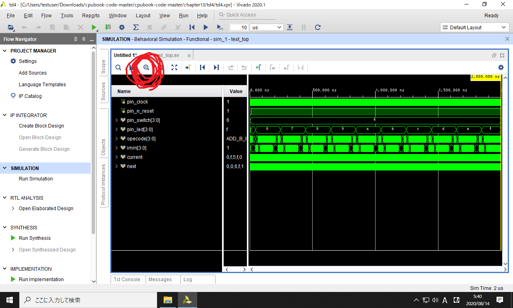

シミュレーション開始時刻付近を見るには、以下のボタンを押します。

10  
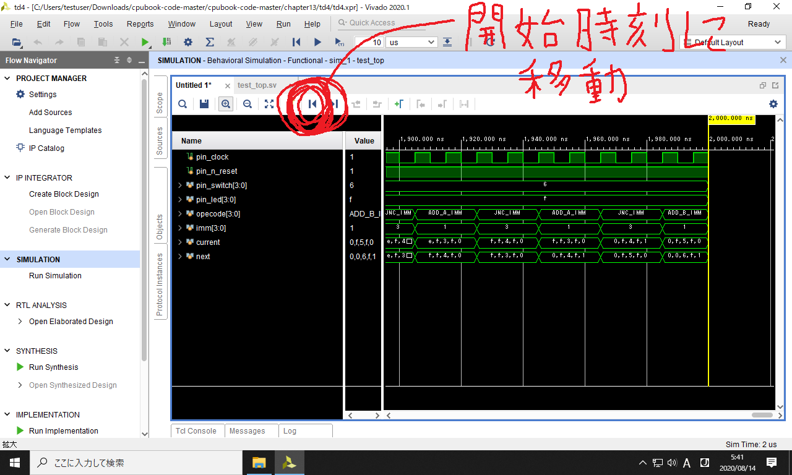

折りたたまれたワイヤーの電圧を見るには、以下のワイヤー名の左の`>`をクリックして展開します。

11  
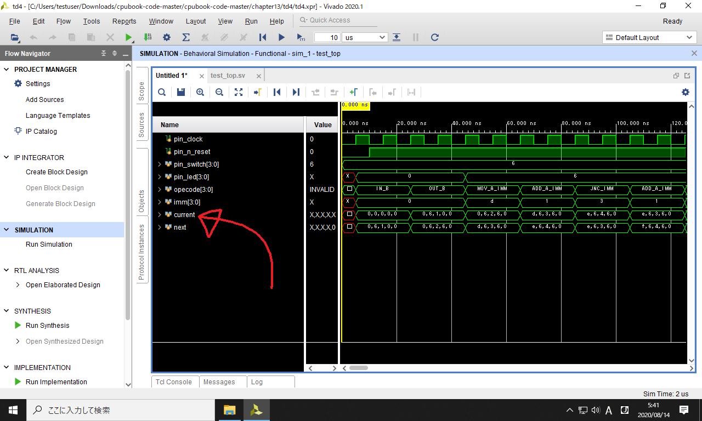

以下のように、`current`の中に折りたたまれていた情報が表示されます。

12  

これで本書の13ページとほぼ同じ図が得られました。
この図の考え方については、本書の144ページで説明します。

引き続き
[ソースコードのコンパイル](../compile/index.md)
のページに進んで下さい。
